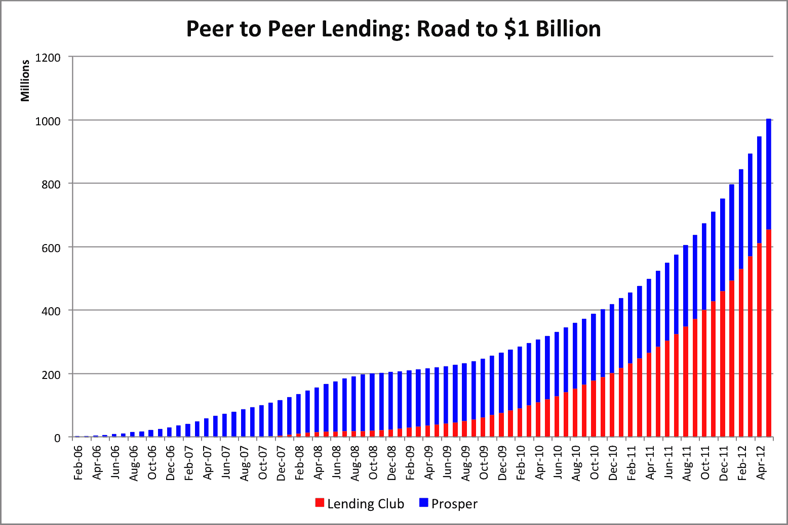

# P2P 贷款突破 10 亿美元 

> 原文：<https://web.archive.org/web/https://techcrunch.com/2012/05/29/peer-to-peer-lending-crosses-1-billion-in-loans-issued/>

# P2P 贷款超过 10 亿美元

**编者按:** *彼得·伦顿是[社交借贷网络](https://web.archive.org/web/20221115021102/http://www.sociallending.net/)的编辑和发行人，这是一个致力于点对点借贷的博客。你可以在 Twitter [@socialloans 上关注他。](https://web.archive.org/web/20221115021102/http://twitter.com/#!/SocialLoans)*

点对点(p2p)贷款一直是一个很有潜力的想法。这是一个简单的概念。把想借钱的人和想投钱的人匹配起来。将银行排除在等式之外，所有人都会受益。

当然，事情没那么简单。当该行业刚刚起步时，Lending Club 和 Prosper 这两家领先企业发现自己受到了美国证券交易委员会(SEC)的审查。2008 年，虽然还处于起步阶段，但两家公司都必须通过昂贵且耗时的 SEC 注册程序。尽管此时许多人正在撰写行业讣告，Lending Club 和 Prosper 都幸存了下来。

如今，随着该行业获得借款人和投资者的广泛支持，两家公司都在蓬勃发展。p2p 贷款的年增长率超过 100%，是增长最快的投资之一。自 2006 年该行业开始以来，该行业现在每月新增贷款超过 5000 万美元，在阵亡将士纪念日周末，贷款总额超过 10 亿美元。

## **为什么 P2P 贷款变得如此流行**

如图表所示，Lending Club 和 Prosper 继续保持着令人瞩目的增长。这种快速增长的背后是什么？

**1。投资者可以获得两位数的回报**

经过几年的低利率，投资者正在积极寻找替代方案。P2P 贷款的回报率在 6-10%之间，甚至有可能超过 10%。虽然存在风险，但大多数投资者在 Lending Club 和 Prosper 获得的收益远高于传统的固定收益投资。

**2。机构投资者正在进入**

去年，机构投资者开始将大笔资金投入 Lending Club 和 Prosper。现在有超过 1 亿美元的机构资金投资于 Lending Club，而且这个数字还在不断增长。Prosper 有几家大型机构投资者，其中一家已经投资了近 3000 万美元，并承诺在未来几年再投资 1.2 亿美元。

**3。消费者想要摆脱信用卡债务**

到目前为止，Lending Club 和 Prosper 上最常见的贷款类型是债务合并。人们正试图摆脱信用卡债务，如果借款人拖欠还款，利率通常会攀升至 25%以上。信用良好的人可以以 12%的利率获得 36 个月的点对点贷款，还清他们的高息信用卡，并在三年内摆脱信用卡债务。对于借款人和借钱的投资者来说，这是一个双赢的局面。

**4。银行仍然不能自由放贷**

银行信贷依然紧张已经不是什么新闻了。个人贷款很难获得，过去十年流行的借贷形式——房屋净值贷款——被金融危机扼杀了。小企业也感受到了压力，因此企业主继续寻找其他融资方式。

**5。该行业正在赢得信誉**

当华尔街巨头之一加入 p2p 贷款公司董事会时，就像约翰·麦克(摩根士丹利前首席执行官)最近在 Lending Club 所做的那样，这提供了一种前所未有的可信度。Prosper 今年还宣布，高盛资深高管埃里克·施瓦茨(Eric Schwartz)加入了他们的董事会。人们再也不能认为 p2p 贷款是一种短暂的趋势。

点对点借贷是一个时机已经成熟的想法。它的快速增长，超过 10 亿美元的发行就反映了这一点。它给借贷双方都带来了好处，现在比以往任何时候都更是如此。P2P 贷款才刚刚起步，所以如果很快突破 20 亿美元大关(可能在未来 12 个月内)，不要感到惊讶。