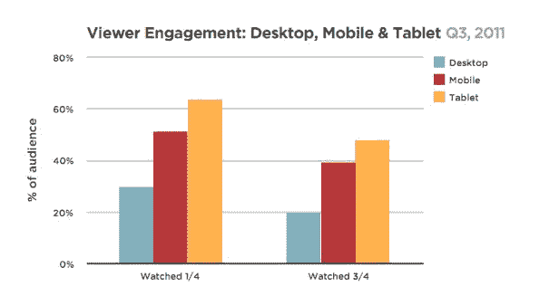
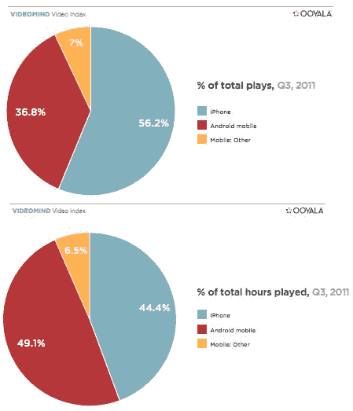

# 现在，人们在平板电脑上观看视频的时间比在台式机上长近 30% 

> 原文：<https://web.archive.org/web/http://techcrunch.com/2011/11/12/people-now-watch-videos-nearly-30-percent-longer-on-tablets-than-desktops/>

这并不奇怪，但是美国人正在观看越来越多的在线视频。事实上，他们几乎是乐此不疲。[根据 comScore 的数据](https://web.archive.org/web/20230205033326/http://www.comscore.com/Press_Events/Press_Releases/2011/10/comScore_Releases_September_2011_U.S._Online_Video_Rankings)，9 月份有 1.82 亿美国人观看了在线视频内容(每位观众平均观看时间为 19.5 小时)，而美国视频观众的视频观看次数总计为 398 亿次。但可能更令人惊讶的是，人们现在在平板电脑上观看视频的程度。

[在线视频技术和服务提供商 Ooyala](https://web.archive.org/web/20230205033326/http://www.crunchbase.com/company/ooyala) ，刚刚发布了它的第一份季度评论，[，你可以在这里找到](https://web.archive.org/web/20230205033326/http://www.ooyala.com/blogs/video-index.html)。虽然数据略有偏差，因为它只考虑了实际观看在线视频的人，但正如 comScore 的数据显示的那样，至少在美国，观看在线视频的人不少。Ooyala 的数据集也很可观，因为该平台每天处理超过 10 亿次分析 pings，揭示了 1 亿每月独立用户的全球观看行为。

从 Ooyala 的研究中得出许多有趣的结论。首先，平板电脑在在线视频观看方面的参与度明显更高，因为平板电脑观众比台式机或移动设备观众观看的时间更长。对于在桌面上观看的每一分钟，平板电脑记录“1:17 的播放内容”，这比桌面平均时间长 28%。

此外，平板电脑观众完成视频的可能性是台式电脑观众的两倍多，因为今年第三季度平板电脑观众的完成率是台式电脑观众的两倍，比移动设备高 30%。

当然，与桌面相比，视频的高参与度不仅限于平板电脑，似乎所有移动设备都是如此:用 Ooyala 的话说，“移动设备上的观众参与度通常高于桌面——即使是长时间的视频”。是的，移动观众以 20%的速度完成了四分之三的长格式视频，相比之下，桌面观众只有 18%。

就长格式视频而言，该研究发现，台式机和笔记本电脑更有可能用于短视频剪辑，而 10 分钟或更长的视频占移动设备上观看时间的 30%，平板电脑上的 42%，以及联网电视设备和游戏控制台上的近 75%。

虽然台式机仍占总视频显示、播放和观看小时数的大部分，但移动设备、平板电脑和连接的电视设备正在越来越多地塑造(和改变)观众行为。对于非桌面视频媒体，移动设备占总播放时间的最大份额，为 48%，而平板电脑占 45%。

虽然联网电视设备在大多数类别中落后，因为该行业仍处于初级阶段，但 Ooyala 认为这些设备正在接近临界点，因为仅在第三季度，联网电视上的视频播放量就增加了两倍。

 当然，说到在移动设备和平板电脑上观看的视频，都是 iOS 和 Android。Android 和 iOS 设备占平板电脑和移动设备视频时长的 90%。对于平板电脑来说，不出所料，iPad 是王者。iPads 贡献了 99.4%的播放量、97.7%的总播放量和 95.7%的总播放时间。

然而，由于其在移动设备市场份额中日益增长的领先地位，Android 的平均转化率为 45%，远高于 iPhones 的 22%。就平板电脑而言，安卓设备的市场份额为 47%，而 iPads 为 13%。

就平板电脑观众的观众参与度而言，两者的比例很接近，但 iPads 的完成率比例更高(为 38%，而安卓为 36%)。

同样值得注意的是:正如 Erick 在 8 月份报告的那样，脸书已经跃升至最大视频平台的第三位，7 月份估计有 5160 万人在脸书上观看视频。自那以后，脸书的数字略有下降，但重点仍然是:在展示广告和现在的视频方面，脸书正以惊人的速度增长。

就这一点而言，Ooyala 发现脸书比它的社交媒体竞争对手 Twitter 更受欢迎。在美国，推特上每分享一个视频，脸书上就分享超过八个。至于作为一个视频分享平台，脸书比 Twitter 受欢迎的程度如何，这因地区而异。在日本，这一比例是 1:1，而在意大利，脸书的受欢迎程度是日本的 17 倍。

最后，Ooyala 的研究似乎证明了内容出版商为平板电脑制定策略变得越来越重要。与台式机相比，观众在平板电脑上观看每部剧的时间延长了 28%，出版商现在开始保证能够在更长的时间内获得观众的眼球。毫无疑问，广告商将会注意到这一点。

要全面了解 Ooyala 的研究，[请点击这里](https://web.archive.org/web/20230205033326/http://www.ooyala.com/webforms/download-video-index)下载。

节选自铜管音乐家的[图片](https://web.archive.org/web/20230205033326/http://brassmusician.com/the-10-commandments-of-trumpet-players/)