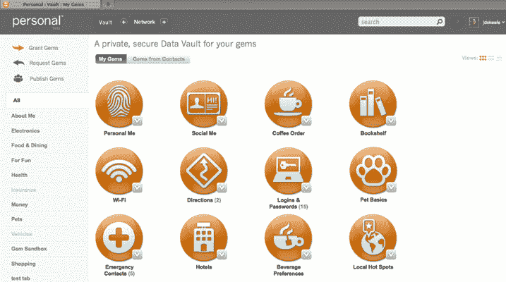
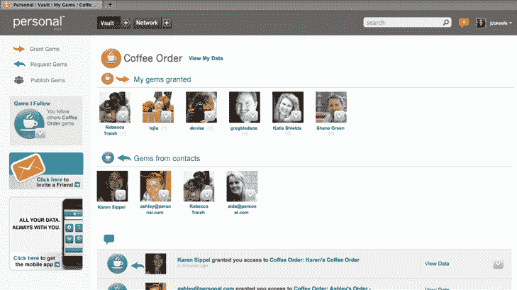

# 个人是您所有私人数字数据的安全保险库 

> 原文：<https://web.archive.org/web/https://techcrunch.com/2011/11/17/personal-is-a-secure-vault-for-all-of-your-private-digital-data/>

# “个人”是一个安全的保险库，用于存放您所有的私人数字数据

我们曾在今年早些时候报道过隐形初创公司 [Personal](https://web.archive.org/web/20230205023917/http://www.personal.com/) ，当时该公司宣布从史蒂夫·凯斯 [Revolution LLC](https://web.archive.org/web/20230205023917/http://www.crunchbase.com/financial-organization/revolution-llc) 、 [Allen & Company](https://web.archive.org/web/20230205023917/http://www.crunchbase.com/financial-organization/allen-and-company) 等公司获得[760 万美元](https://web.archive.org/web/20230205023917/https://techcrunch.com/2011/01/06/personal-raises-7m-from-steve-case-and-others-to-help-consumers-protect-their-digital-data/)的投资。本周，Personal 终于向公众推出了其服务，旨在让消费者能够控制自己的数字数据。

Personal 是一项免费的网络和移动服务，它可以帮助您控制关于您自己和生活的所有数字信息，决定谁可以访问这些信息，并为您的利益而使用这些信息。这些信息包括您的密码、您孩子的过敏症、紧急联系人、信用卡信息等等。基本上，任何你可能不想存储在电子邮件中，但希望能够与你所爱的人或朋友分享的信息。

使用 Personal，您可以将各种信息存储在“数据仓库”中，在那里您可以有选择地与他人共享某些数据仓库。当然，所有的个人账户都包含一份法律保证书，保证你在系统中拥有你的数据。

例如，使用“个人”的一种方式是通过它的“表单黑仔”应用程序。你只需输入一次个人数据(你通常会在表格中输入地址、社会安全号码、出生数据等信息)，然后你就可以使用初创公司的 Form 黑仔应用程序，点击一下就可以完成表格

在个人的核心，是创业公司所说的“宝石”宝石是可重复使用的信息的金块，代表你生活的细节——你的家庭、宠物、汽车、家、办公室、食物和旅行偏好等等。使用我们的授权和请求功能，您可以决定将哪些宝石添加到您的保管库中，以及与他人共享哪些宝石。你可以从 LinkedIn 和脸书下载现有数据。个人也有一个宝石画廊，你可以在那里浏览你需要使用的宝石。

您的个人数据保险库是一个安全和方便的地方为您的宝石。您放入 gems 的所有敏感数据必须使用所有者选择的密码锁定和解锁，个人不会存储该密码，因此无法访问该密码。“个人”使用 256 位 SSL 加密和 HTTPS 来确保在数据从您的计算机来回传输到“个人”时不会被窃听。

Personal 在移动网络上可用，并将推出原生 Android 和 iPhone 应用程序，不久将会发布。

有很多类似于 Personal 的服务(如 [Singly](https://web.archive.org/web/20230205023917/https://singly.com/) )，但该服务有一个优势是它相对干净和易于使用的用户界面。这使得了解哪些数据被共享变得非常容易。考虑到我们在通过电子邮件甚至脸书分享某些类型的机密信息时的一些犹豫；需要一种私有的(并且高度安全的)数据组织服务。

作为背景，Personal 是由开发商业地图应用[地图网络](https://web.archive.org/web/20230205023917/http://www.crunchbase.com/company/the-map-network)(2006 年被 NAVTEQ 收购)的同一个管理团队创建的。

