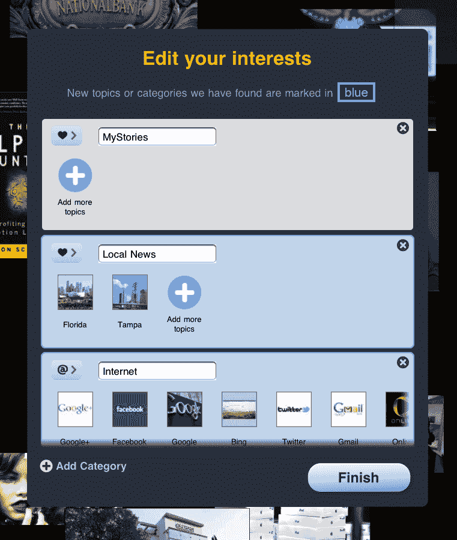
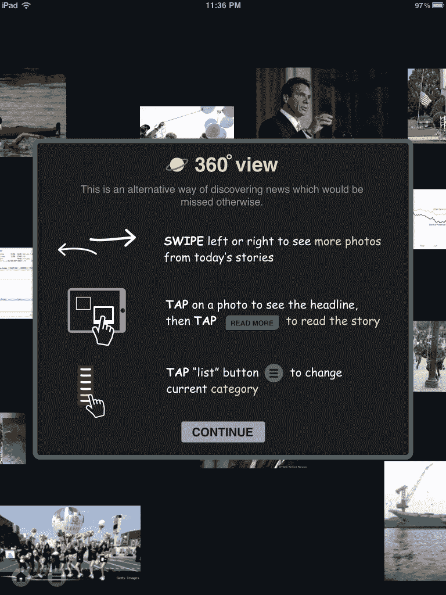

# 个性化新闻聚合:News360 推出 2.0 版 TechCrunch

> 原文：<https://web.archive.org/web/http://techcrunch.com/2011/08/10/personalized-news-aggregation-news360-launches-version-20/>

跨平台新闻阅读器应用程序 [News360](https://web.archive.org/web/20230203133207/http://www.news360app.com/) 今天发布了 2.0 版本，这是一个重大更新，引入了新的个性化功能。新闻阅读器现在从你在社交网络服务上的活动中学习，包括脸书、推特、谷歌阅读器和 Evernote，以便为你提供符合你兴趣的故事。

但与它的一些竞争对手不同的是，News360 使用语义分析来提供当天最相关的新闻，包括来自你最喜欢的来源的关于你最喜欢的话题的故事。

**语义引擎从你的动作中学习**

在 iPad、Android、Windows Phone、PlayBook 和现在的 Web 上运行的 [News360](https://web.archive.org/web/20230203133207/http://www.news360app.com/) 应用程序的语义基础是该应用程序的一个关键区别。此前，该公司利用这些智能算法来呈现世界、美国、政治、商业、科技、犯罪、体育、艺术等类别中最重要的新闻。

但是现在，同样的技术被用来更好地个性化你自己的新闻阅读体验。News360 语义引擎知道大约 700，000 个不同的实体，News360 首席执行官 Roman Karachinsky 解释说，每个人通常有 5 到 10 个“持久”的兴趣。在深入研究你的社交网络活动后，应用程序会自动为你发现这些兴趣。

为了确定这些兴趣是什么，该应用程序不会只从一个网络或一个数据集(例如，你在脸书上的“赞”或你在 Twitter 上的“收藏夹”)中提取数据，它会查看所有东西……当然，是在许可的情况下。

除了脸书喜欢，该应用程序还读取你的脸书个人资料，查看你的评论和分享，并检查你如何与内容互动。在 Twitter 上，它会查看你的简历、列表、推文和收藏夹。在谷歌阅读器上，它知道你分享了什么，你加了什么星，你读了什么，点击了什么。在 Evernote 上，它会查看你保存了哪些网页剪辑，尤其是那些与新闻相关的。

**超越个性化——news 360 也有聚合功能**

个性化并不是 News360 唯一的技巧，它只是最新的一个。这款应用的名字来源于它的主要卖点:新闻的“360 度”视角。也就是说，News360 为您呈现了来自多个新闻媒体的综合报道，让您可以从一个故事转到另一个故事，以便全面了解所报道的主题。它还可以让你通过照片浏览新闻，这仍然是一个骗局，而不是实际操作。

然而，作为一个贪婪的信息消费者,“360 度”功能对我有一定的吸引力——尽管它目前的实现方式。这并不是说在应用程序中使用“360 度”视图很难，只是我对这个设计没有什么印象。例如，当面对像 Flipboard 这样的强大新闻阅读器时，我觉得，它必须是 iPad 上出现过的最优雅的新闻阅读体验之一，需要对前端设计和幕后令人讨厌的数据处理机器人给予同等的关注。

【T2

上图:那是什么字体？！

此外，Flipboard 一直在稳步实施它从一家名为 [Ellerdale](https://web.archive.org/web/20230203133207/https://techcrunch.com/2009/11/20/the-ellerdale-project-mines-the-web-to-help-you-make-sense-of-real-time-streams/) 的语义初创公司收购的技术，以提高其自身的个性化和整体“智能”。Flipboard 联合创始人迈克·麦库埃最近告诉我，这款应用很快会有一次重大的个性化升级。

考虑到这一点，它可能根本不是数据(News360)和设计(Flipboard)之间的选择，它可能是数据…或数据*和*设计之间的选择。在这场战斗中，我不相信 News360 会赢。