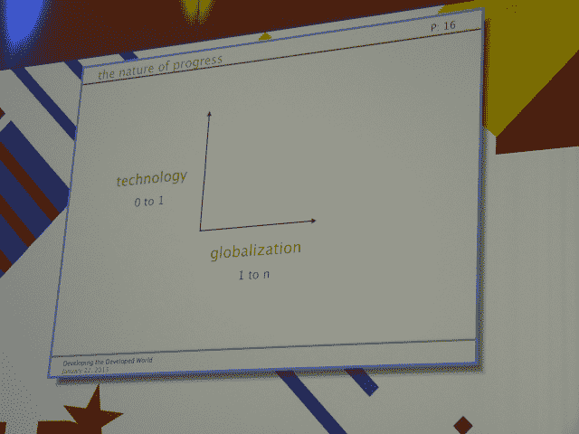
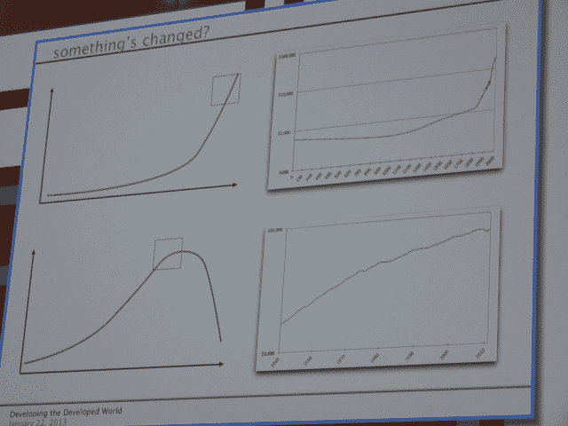

# 彼得·泰尔谈论教育的未来、创新的需要以及脸书在 DLD TechCrunch 获奖的原因

> 原文：<https://web.archive.org/web/https://techcrunch.com/2013/01/22/peter-thiel-at-dld/>

PayPal 联合创始人、早期脸书投资者和创始人基金合伙人[彼得·泰尔](https://web.archive.org/web/20230120211143/http://www.foundersfund.com/team/peter-thiel)今天登上 DLD 会议的舞台，就教育的未来、我们如何在发达国家保持增长以及为什么脸书战胜了 MySpace 进行了广泛的讨论。

泰尔认为，21 世纪将是全球化和技术的世纪。他认为，这是两码事。技术是关于创造新的和快速增长的东西，而全球化是关于复制已经有效的东西。泰尔说，在下个世纪，“我们必须双管齐下。”

## 增长和创新的需求

在泰尔看来，当前的发达国家集团可能会发生四件事。增长和创新可以继续减速，它们可以进入增长和崩溃的循环模式，完全崩溃，或者继续加速。当然，在他看来，最终唯一可以接受的选择是加速增长。

【T2

然而，今天的问题是，在发展中国家有许多 xyz，我们停滞不前，近年来没有看到重大创新。他认为，我们今天的旅行速度并不比 50 年前快，我们仍然没有治愈癌症，20 世纪 60 年代的科幻太空旅行仍然是科幻小说。

然而，我们做得好的一个领域是计算机，这主要归功于摩尔定律和软件的快速发展。因此，他认为，如果我们想在创新放缓的所有领域继续看到加速增长，我们就必须依靠技术。他列举的例子已经处于成为现实的尖端，如谷歌的自动驾驶汽车可以解决一些交通问题，以及生物信息学革命可以在未来几年推动医疗保健向前发展。

当被问及增长和加速的有害影响时，泰尔指出，他在谈论“良好的技术创新”，包括改善经济福祉和可持续性。然而，他认为唯一的出路是通过技术进步，因为否则将使数百万人陷入贫困。

## 泰尔论教育

泰尔认为，作为一名投资者，这意味着他对连接虚拟世界和现实世界的公司最感兴趣。他认为，贝宝这么做是为了钱。例如，虽然许多虚拟货币初创公司在 20 世纪 90 年代试图创造新的完全虚拟的货币，但 PayPal 意识到最好的解决方案是将现有的货币系统与互联网结合起来。他说，脸书也是如此。他指出，MySpace 成立的时候，人们仍然相信互联网身份的未来将是化身和替代身份。他说，脸书的关键见解是“关注真实的人和真实的身份。”我们并不是要逃避这个世界，创造一个虚构的替代世界。"

泰尔的“20 岁以下 20 岁以下”计划为跳过大学的学生提供百万美元的奖学金，当他大约两年前首次宣布这一计划时，引起了不小的轰动。根据 Thiel 的说法，教育仍然停留在 19 世纪，包括像我们学校的样子这样的基本细节。“教育几乎是技术的对立面，”他认为。“我们现在用越来越多的资源做着同样或更少的事情。”教育是一个万亿美元的行业，“它所支付的是价值约万亿美元的谎言，这些谎言是关于人们所受的教育有多好。”

他说，当他在 2007 年开始关注教育时，他的“想法是向大学投入更多资金，甚至可能创办一所新大学。”然而，当他和他的团队观察最近成立的大学时，他们注意到大多数都不起作用。在教育上投入更多的钱并不是解决问题的办法。当被问及该项目如何扩大规模时，泰尔坦率地承认，他“对这个问题没有很好的答案”。然而，他确实相信，就像扩大创业规模一样，如果你指导几个学生并成为榜样，其他人将不可避免地效仿。