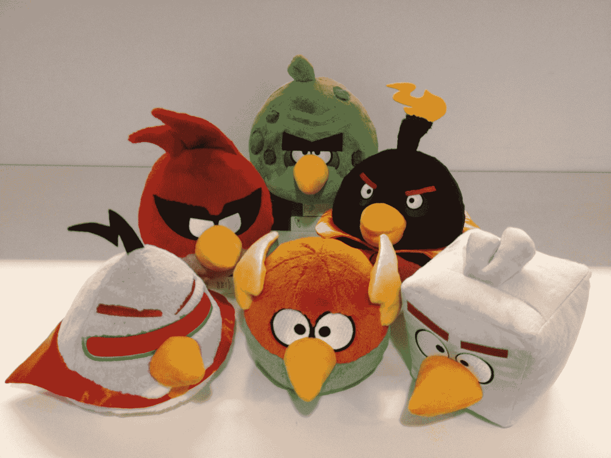

# 强大的鹰自己，彼得·维斯特巴卡，提供了愤怒的小鸟空间 TechCrunch 的第一次深入演示

> 原文：<https://web.archive.org/web/https://techcrunch.com/2012/03/15/peter-vesterbacka-angry-birds-space-demo/>

在我知道《愤怒的小鸟》这部电影之前，我就已经对它感到兴奋了。就像[那首糟糕的野人花园歌曲](https://web.archive.org/web/20221003185826/http://www.youtube.com/watch?v=jjnmICxvoVY):“我想我把它梦想成真了。”唯一的事情是，我没有把它梦想到生活中；彼得·维斯特巴卡和他在 Rovio 的团队做到了。在先睹为快最新最棒的《愤怒的小鸟》之后，我可以自信地说，这将是迄今为止最好的版本。

Vesterbacka 以前说过，但他今天早上再次明确表示，《愤怒的小鸟太空》将是 Rovio 有史以来最大的一次发布。商品，包括我们坐在办公室里的毛绒玩具，将在 3 月 22 日发布日当天上市。Rovio 还与 Daily 合作创建了一个全面的《愤怒的小鸟太空指南》,包括新的角色简介、太空信息以及 NASA 对游戏物理原理的详细解释。

说到游戏，《愤怒的小鸟空间》在游戏玩法上与之前的版本有着本质的不同。由于太空恰好是[一个零重力环境](https://web.archive.org/web/20221003185826/https://beta.techcrunch.com/2012/03/08/rovio-goes-gravity-free-with-angry-birds-space-video/)，将鸟类弹射到充满猪的结构中的想法并不那么容易转化。但这就是重点。

愤怒的小鸟空间使用战略放置的重力井和行星体来引导你的小鸟，而不是均匀的引力。这与新的角色和我所见过的最美丽的愤怒的小鸟场景相结合，应该会成为另一个 Rovio 的热门。

维斯特巴卡指出，Rovio 不仅仅是一家游戏公司，它还是一家“下一代娱乐专营公司”事实上，该公司不仅仅是一个游戏制造商。

在采访结束后我们去大厅的路上，大鹰提到 Rovio 正在尽可能地利用中国市场。他说，中国山寨“愤怒的小鸟”产品的数量与其说是令人沮丧，不如说是讨人喜欢，而且该公司只有在山寨产品损害品牌时才会介入。他举了一个咖啡杯制造商用铅制作愤怒的小鸟风格杯子的例子。

维斯特巴卡说:“我认为(中国人)看到我们理解这个国家的打假文化，并意识到我们希望成为其中的一部分，反过来，他们宁愿购买我们的产品，也不愿购买仿冒品。”。Rovio 计划在今年底/明年初在中国开设至少 200 家零售店。

说到年度目标，到 2012 年底，Rovio 将在 iOS 和 Android 上推出另外四款愤怒的小鸟游戏(不包括愤怒的小鸟空间)。如果你问我，那是非常忙碌的一年。

Rovio 最近一直在增加员工，从 50 名员工增加到目前的 200 名。未来几个月，北京的办公室也应该会从少数几个增加到 50 个左右，Vesterbacka 说，他肯定有兴趣挖一些模仿产品设计师。

长话短说，Rovio 不会很快销声匿迹。

“我们总是试图给我们的粉丝带来惊喜和真正的快乐，”维斯特巴卡说。“你能从我们这里期待的是意想不到的。”

*(编辑注意:这是一段早期视频的更新版本，我们现在正在重新发布。所以，如果你以前看过这篇文章，并且想知道它为什么又出现在这里，你不会发疯的。我们道歉。)*