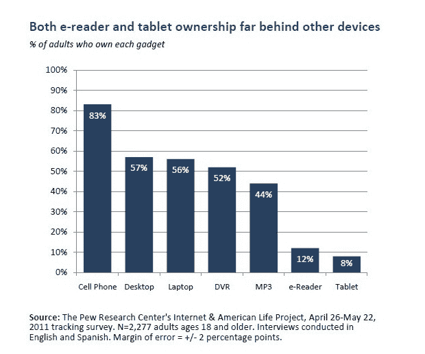

# 皮尤:电子阅读器的采用率在 6 个月内翻倍，超过平板电脑 

> 原文：<https://web.archive.org/web/http://techcrunch.com/2011/06/27/pew-e-readers-doubles-6-months/>

# 皮尤:电子阅读器的采用率在 6 个月内翻了一番，超过平板电脑

2011 年 5 月进行的一项新的[皮尤研究调查](https://web.archive.org/web/20230203035249/http://pewinternet.org/Reports/2011/E-readers-and-tablets/Report.aspx)对美国成年人的调查显示，亚马逊 Kindle 或 Barnes & Noble Nook 等电子阅读器的拥有率现在为 12%。电子阅读器的拥有率从六个月前的 6%翻了一番。

电子阅读器的采用继续超过 iPad 和摩托罗拉 Xoom 等平板电脑。只有 8%的受访者表示他们赢得了一台平板电脑，而六个月前这一比例为 5%。因此，平板电脑的拥有率似乎在以较慢的速度增长。

然而，电子阅读器和平板电脑之间的界限开始模糊。Color Nook 运行的是一个版本的安卓系统(尽管没有最新的平板电脑功能齐全)。当然，现在每台平板电脑都有 Kindle、苹果和其他公司的电子书应用。

3%的美国成年人同时拥有平板电脑和电子阅读器。(你们这些尝鲜的什么都会买)。

平板电脑和电子阅读器仍然远远落后于其他数字设备的拥有量，如 MP3 播放器(44%)、DVR(52%)、笔记本电脑(56%)、台式机(57%)和手机(83%)。这也是该调查中笔记本电脑和台式机拥有率首次持平。

