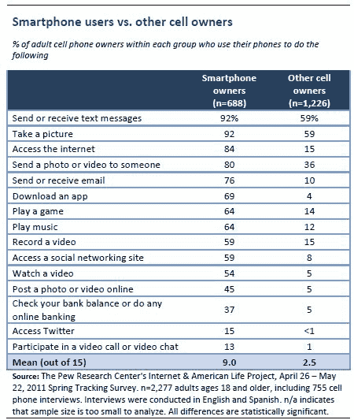

# 皮尤调查:半数美国手机消费者使用手机进行实时信息检索 TechCrunch

> 原文：<https://web.archive.org/web/http://techcrunch.com/2011/08/15/pew-mobile-realtime/>

# 皮尤调查:半数美国手机消费者使用手机进行实时信息检索

移动计算比桌面计算更实时。这是显而易见的。通常，当你在旅途中时，你会想知道你周围正在发生什么。皮尤互联网研究项目今天发布了一项新的调查，量化了多少人依靠手机获取实时信息。在过去的一个月里，51%的美国成年手机用户使用他们的手机获取“他们马上需要的”即时信息

另有 40%的人在紧急情况下使用手机。而大约 42%的人用手机来“打发无聊”对于 18-29 岁的人来说，这个比例是 70%。

因此，手机似乎至少在两件事上有好处:实时信息消费(不要再看你的脸书信息)和娱乐(我猜主要是游戏)。它们也有助于避免与他人的个人接触。整整 13%的受访者承认，他们“假装使用手机，以避免与周围的人互动。”

该调查还特别深入智能手机的使用情况。皮尤估计，35%的美国人现在拥有智能手机。最受欢迎的活动是发短信和拍照(两者不相上下，92%的智能手机用户表示他们会做每一项活动)。更多的智能手机用户用手机发送照片(80%)而不是电子邮件(76%)。84%的人使用互联网。59%的人访问社交网站，而只有 15%的人访问 Twitter。

