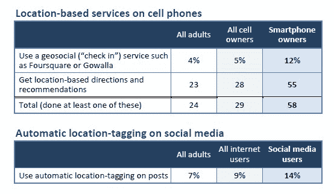

# 皮尤:超过四分之一的美国成年人使用移动和基于位置的社交服务 

> 原文：<https://web.archive.org/web/https://techcrunch.com/2011/09/06/pew-more-than-a-quarter-of-u-s-adults-use-mobile-and-social-location-based-services/>

# 皮尤:超过四分之一的美国成年人使用移动和社交定位服务

毫无疑问，随着智能手机使用的增加，地理定位正在成为消费者日常生活中一项越来越重要的技术。皮尤互联网研究项目发布了一份新报告，显示越来越多的美国成年人在社交和移动应用中利用基于位置的技术。根据皮尤的调查，28%的成年人至少使用一种存在于移动和社交媒体空间的基于位置的服务。该报告显示，基于位置的技术最受欢迎的使用案例是使用手机获取地图、方向或建议。

皮尤报告称，28%的手机用户使用手机获取基于其当前位置的指示或建议(相当于 23%的美国成年人)。只有 5%的手机用户使用手机登录 Foursquare 或 Gowalla 等应用程序。

9%的互联网用户在脸书、Twitter 或 LinkedIn 上显示自己的位置(占所有成年人的 7%)。28%的美国成年人至少在电脑或手机上做其中一项活动。

毫不奇怪，智能手机用户更有可能在手机上使用基于位置的社交网络。十分之一的智能手机用户(12%)使用过 Foursquare、Gowalla 或类似的应用程序，55%的智能手机用户使用过基于位置的信息服务。几乎十分之六(58%)的智能手机用户至少使用其中一种服务。

皮尤称，年轻的智能手机用户更有可能在手机中使用定位服务。皮尤称，地理社交服务和自动位置标记在少数族裔中最受欢迎。四分之一(25%)的拉丁裔智能手机用户使用地理社交服务，近三分之一(31%)的拉丁裔社交媒体用户启用了自动位置标记。皮尤表示，只有 7%的白人智能手机用户使用地理社交服务，59%的人通过手机获取基于位置的信息，相比之下，黑人和西班牙裔的这一比例分别为 53%和 44%。

皮尤[在近一年前报道说](https://web.archive.org/web/20230204230959/https://techcrunch.com/2010/11/04/pew-4-of-americans-use-location-services-oh-and-there%E2%80%99s-that-facebook-places-thing/)只有 4%的美国成年人使用基于位置的服务。我猜想，自去年 11 月以来，这个数字已经增加了。

