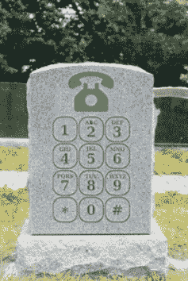

# 电话号码是死的，他们只是还不知道而已 TechCrunch

> 原文：<https://web.archive.org/web/https://techcrunch.com/2010/08/28/phone-numbers-dead/>

***编者按**:以下客座博文由语音应用初创公司 [SayNow](https://web.archive.org/web/20221006020817/http://www.saynow.com/) 的联合创始人兼首席执行官[尼克希尔·辛哈尔](https://web.archive.org/web/20221006020817/http://www.saynow.com/info/team)撰写。*

可以想象我们最伟大的发明之一，电话号码，即将面临灭绝吗？

问问马克·扎克伯格就知道了。今年早些时候，[当有人问](https://web.archive.org/web/20221006020817/http://www.youtube.com/watch?v=_TuFkupUn7k&t=13m2s)只要马·贝尔还在，脸书 100 年后还会在吗，扎克伯格回答说:“我不知道。但我不知道电话还会存在多久。”它们还会存在十年吗？我会更进一步。正如我们所知，电话服务甚至可能不需要 5 年就会走向灭亡。

谁将带头冲锋？[Gmail 上的语音](https://web.archive.org/web/20221006020817/https://beta.techcrunch.com/2010/08/25/google-voice-integrated-into-gmail-make-and-receive-calls-from-the-browser/)和 [Skype 上的语音](https://web.archive.org/web/20221006020817/https://beta.techcrunch.com/2010/08/09/skype-ipo/)只是一个开始。脸书、苹果、雅虎和微软在做什么？就在这个夏天，威瑞森、苹果和谷歌都在制定统治世界的计划，看起来脸书最有条件给我们心爱的运营商致命一击。从那些电话号码开始。

我确信我的孙子们永远不会拨电话号码，甚至不会有一个。是时候告别十位数以及世界上最古老的社交网络了。当我们在做这件事的时候，让我们消灭电话树迷宫、拒绝来电名单…一切与电话号码有关的东西。

不要误解我说的话。这并不是电话的消亡。远非如此。人们还是会用手机聊天。他们只是希望服务简单有趣，不需要在设备上输入数字来开始对话。

为什么要把电话号码放在死亡观察上？考虑几个事实:

1.  **无控制。任何人都可以拨打你的 10 位数，包括你的前女友、政治活动工作者或律师。未列出的号码，来电显示和不要呼叫列表都试图解决这个问题，但这些解决方案仍然不能防止不想要的电话。**
2.  电话号码是绑定在一个设备上的，而不是你。每个人都有多个号码，但您的家庭电话是共享的，让来电者猜测联系您的最佳方式。
3.  **用户体验非常有限。**手机被设计成一种实用工具——拨打号码，进行对话。从一开始就一直如此。它没有针对其他体验进行优化，这就是为什么语音邮件和电话会议很乏味，为什么检查航班状态比根管治疗还糟糕。

与你的社交网络相比。您可以控制谁可以访问您的信息；您有一个一直使用的用户名和个人资料；应用程序填补了这些漏洞，扩展了网络的功能，让你可以按照自己的方式交流、玩游戏和与人交往。

在脸书的任何页面上，我都可以“发送信息”，即使我们不是朋友。而且我可以选择接收非好友的消息。关键是网络设置了一个策略，而我作为一个用户可以改变它。今天，我们在电话网络上没有这种选择。任何人都可以拨打我的号码，我无法控制它——但我确实可以控制我在社交网络上的互动。

谷歌、Skype 和其他公司试图通过将电话系统嵌入网络来解决电话问题。就我个人而言，我已经在 [SayNow](https://web.archive.org/web/20221006020817/http://www.saynow.com/) 工作了五年，试图从基于数字的电话系统中获取更多信息。我们已经开发了几十个应用程序，让品牌、名人和数百万用户以全新的方式使用手机。但是我们都达到了我们所能达到的极限。让我们不要在网络中复制陈旧的电话网络，而是通过在我们的社交网络上添加语音来大大简化电话。

如果让我们在马云贝尔和扎克伯格之间选择一个作为我们的运营商，我们应该选择[扎克](https://web.archive.org/web/20221006020817/http://www.crunchbase.com/person/mark-zuckerberg)。尽管有人对脸书的隐私设置提出了批评，但网站给了我们比在电话上更多的互动控制权。由于我们的联系人生活在网络中，我们已经属于世界上最大的白页。随着越来越多的企业转向社交网络，全球黄页也加入进来。因此，告别丢失的电话号码，在设备之间移动联系人，甚至 411。更重要的是，就像你决定谁可以看到你的单身派对照片一样，你很快就可以完全控制谁可以给你打电话，谁不能。当我写这篇文章的时候，我已经听到我的妻子说，“亲爱的，为什么我妈妈不能再给我们打电话了？”

与此相关的还有开发者每天大量生产的创意智能手机应用。这些都没有利用这些移动设备存在的主要原因:语音。一旦智能手机平台允许开发者发起对话和语音消息，你可以打赌语音最终会变得灵活和有趣。

说到这个，我最近参加了一场 Lady Gaga 的演唱会，维珍移动公司的好心人安排 Gaga 给一位粉丝[打了一个升级座位的电话](https://web.archive.org/web/20221006020817/http://www.youtube.com/watch?v=rHhkYrtjDUU)，让她大吃一惊。好主意，但我们都知道整个活动是精心策划的。但如果不是呢？Lady Gaga 应该可以打开她的 iPhone，看到她的脸书、Twitter 或 MySpace 粉丝，选择在会场登记的人，然后…(提示鼓声)，打电话给他们。打电话给其中一个。其中一些。全部都是。无论你有 500 万个朋友还是只有 500 万个，打电话都应该这么简单。所以，当这些数字还在的时候，享受敲击它们的乐趣吧。