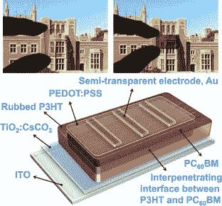

# 液晶显示器中的光伏电池可以回收废物和环境光技术危机

> 原文：<https://web.archive.org/web/http://techcrunch.com/2011/08/15/photovoltaic-cells-in-lcds-could-recycle-wasted-and-ambient-light/>

# 液晶显示器中的光伏电池可以回收浪费的和环境光

加州大学洛杉矶分校的研究人员对传统的液晶显示器进行了改造，允许显示器回收背光中浪费的光子，甚至充当普通的太阳能电池。普通的液晶显示器依赖于不间断的背光，但是因为液晶显示器的工作方式，大部分的光线都无法逃逸。这种固有的低效率并没有阻止我们获得明亮的显示器，但是让它们如此明亮所需的能量通常会耗尽您的电池。

进入加州大学洛杉矶分校材料科学系的杨洋教授和他的工程师团队。液晶显示器的各层中有两块偏光板，可根据其配置阻挡不需要的背光。加州大学洛杉矶分校的团队为这些层设计了一种新型材料，称为偏振有机光伏薄膜。它不会简单地阻挡光线，而是像光伏电池一样，重新吸收一些光线能量——无论是来自设备内部还是外部。本质上，它将回收来自背光的光，同时充当太阳能电池。

对于电池寿命和功耗等问题没有做出保证，因为它们取决于许多其他因素，但英特尔的 Youssry Botros 评论称，它“可能从液晶背光中收集 75%的浪费光子，并将其转化为电能。”自己进行计算。他后来使用了“协同”这个词，我认为他的意思是协同，但老实说，他的版本听起来更好。

杨希望与制造商合作，使这成为主流，并说这种方法是“简单的。”尽管如此，不要指望你的手机很快就能用这种方法充电。这项发表在《先进材料》杂志上的研究是由英特尔和海军研究办公室出资进行的。

[通过[热硬件](https://web.archive.org/web/20230203181045/http://hothardware.com/News/UCLA-Researchers-Develop-Method-For-LCDs-That-Recycle-Energy/)