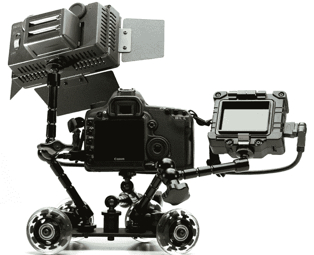

# Pico Dolly:适用于小型相机的小型移动系统 TechCrunch

> 原文：<https://web.archive.org/web/http://techcrunch.com/2011/09/01/pico-dolly-a-diminutive-dolly-system-for-smaller-cameras/>

# Pico Dolly:适用于小型相机的小型移动系统

如今，每个人都是电影制作人，因为高质量的高清视频和编辑分发工具随处可见。但是相机不是你拍电影唯一需要的东西。没有三脚架和某种运动控制系统，你只能用颤抖的手拿着东西站在桌子和椅子上。一个小型三脚架和一个组装在一起的稳定器很简单，但是推车呢？

Pico Dolly 通过一个简单、实惠、非常酷的小平台满足了这一需求。创造者 CheesyCam 担心现有的推车要么太大，要么太贵，要么质量太差。因此，他们制作了这个带有严肃的轴承、全金属结构和三个螺旋安装臂的空间的机器人——同时占用尽可能少的空间。轮子可以调整，使相机描绘一个小圆，或拉直成一条直线。观看视频，了解其工作原理:

[YouTube w = 640 http://www.youtube.com/watch?v=PkaP4Oz0-RU]

它的重量不足以将 DSLR 甩出太远，但你可以用重物或附件来平衡它，这样它就不会翻转，正如你在这里看到的:

最精彩的部分？[如果你提前预订，这个小东西只会让你花费 65 美元](https://web.archive.org/web/20230203134443/http://photographyandcinema.com/index.php/products/item/pico-dolly?category_id=1)(它们将在两周内发货)。对于任何有兴趣增加业余电影摄影趣味的人来说，这是微不足道的。可重新定位的手臂单独出售，每个 25 美元，或者你可以自己组装解决方案。

是的，在某种程度上，它只是一点金属，上面有一些滑轮——就像三脚架只是三根金属棒在顶部粘在一起一样。我真的可以想象自己使用其中一个。

[通过[百帕像素](https://web.archive.org/web/20230203134443/http://www.petapixel.com/2011/09/01/pico-dolly-pint-sized-wheels-for-cameras/)