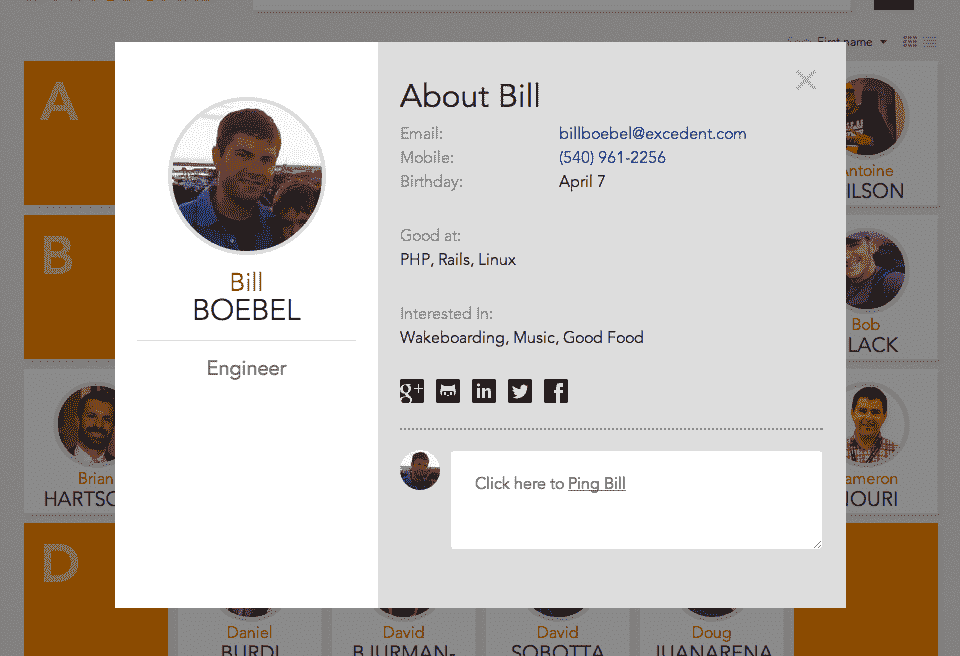

# Pingboard 获得 125 万美元的种子资金，用于实现办公室管理现代化 

> 原文：<https://web.archive.org/web/https://techcrunch.com/2014/01/15/pingboard-secures-1-5m-in-seed-funding-to-modernize-office-management/>

办公室管理并不是大多数初创公司都涉足的领域，但今天推出测试版的 [Pingboard](https://web.archive.org/web/20221007025352/http://pingboard.com/) 旨在成为“办公室经理最好的朋友”。该公司辩称，这是第一个为办公室经理打造的真正现代的服务。Pingboard 今天还宣布，它已经筹集了 125 万美元的资金。

Pingboard 说，虽然企业经常开发自己的解决方案，但它希望成为中小型企业和初创公司的办公室管理解决方案。该公司表示，这些仍然倾向于依赖很少更新的电子表格(我们在 TechCrunch 也有一些)和手动流程。另一方面，Pingboard 将所有员工信息存储在一个地方。

该服务还提供了一个 API，因此需要将其目录连接到更复杂的应用程序并拥有这样做的资源的公司可以扩展该服务以满足他们自己的需求。

事实上，虽然该公司是从这一目录服务开始的，但它确实将自己视为一个平台。它开始时规模很小，因为它相信拥有核心目录数据可以支持更多有趣的用例。该团队表示，这可能是从为公司午餐订单提供动力到进入人力资本管理的任何事情。从长远来看，这就是 Pingboard 团队认为其服务的真正价值所在。

该公司告诉我，“我们首先将重点放在员工名录上，因为实际上办公室中需要自动化的一切都以员工信息为中心。”

作为核心服务的一部分，Pingboard 包括一些基本的消息传递功能(使用电子邮件或短信)，例如，当员工有访客或有包裹到达时，他们可以轻松地相互通知或接收办公室经理的通知。该系统中的所有数据都可以从电子表格中导入，并与谷歌应用程序、社交档案和人力资源系统自动同步。该服务还允许用户使用谷歌应用程序账户登录。

这项服务是由比尔·博贝尔(首席执行官)和罗布·埃尼斯(首席技术官)创建的。Boebel 是总部位于奥斯汀的天使投资人，与 OtherInbox 创始人 Joshua Baer 和 WP Engine 创始人 Jason Cohen 一起，是[资本工厂](https://web.archive.org/web/20221007025352/http://capitalfactory.com/)的一部分。他之前创建了 Webmail.us，该网站于 2007 年被 Rackspace 收购。他在 Rackspace 一直工作到 2011 年。该项目在由 Boebel、Baer 和 Cohen 创办的孵化器[资本思想](https://web.archive.org/web/20221007025352/http://about.me/capitalthought)孵化。

Pingboard 这轮融资的主要投资者是 Silverton Partners。Baer 和 Cohen 也投资了这一轮，Webmail.us 的创始人 Pat Matthews，Rackspace 的资助者 Pat Condon，Indeed.com 的创始人 Rony Kahan 和 RightScale 的创始人 Jonathan Siegel 也投资了这一轮。