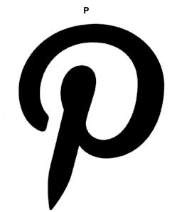
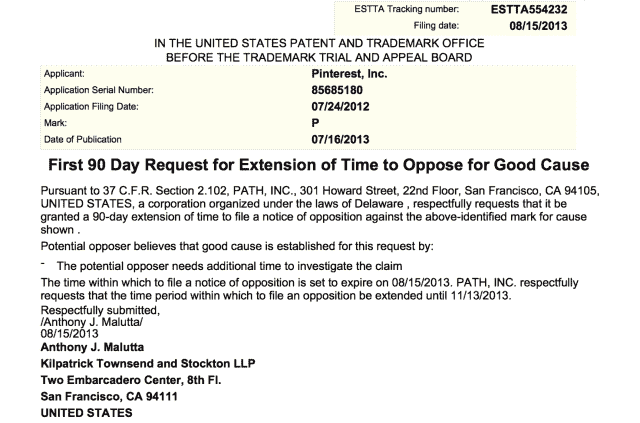

# Pinterest 和 Path 争夺字母“P”标志商标 TechCrunch

> 原文：<https://web.archive.org/web/https://techcrunch.com/2013/09/06/pinterest-and-path-to-battle-over-letter-p-logo-trademark/>

[路径](https://web.archive.org/web/20230121024528/http://www.path.com/)和[Pinterest](https://web.archive.org/web/20230121024528/http://www.pinterest.com/)logo 是否过于相似？Path 显然是这么认为的。这家移动通讯初创公司目前正在努力阻止 Pinterest 收购字母“P”的商标，作为一种风格化的设计([，就像这里显示的](https://web.archive.org/web/20230121024528/https://www.docketalarm.com/trademarks/85685180/P/)，以及下文)。美国商标局允许 Pinterest 在这个拟议的设计商标上注册商标，但最近 Path 要求延期，以便提出异议。

现在看这场斗争会走向何方还为时过早，但如果 Pinterest 获得了“P”的商标，它可能会阻止 Path 和其他应用程序使用类似的设计，专利律师莱尼·克拉韦茨解释道，他是 InterDigital Communications 的专利顾问。

 这是商标界一直在发生的一场战斗，各家公司都在努力想出独一无二的、区别于竞争对手和同行的商标。然而，这个特殊的案例很有趣，因为 Pinterest 和 Path 应用程序的设计风格越来越相似，这可能会导致所谓的“消费者混淆”，并使商标问题变得更加重要。

你可能还记得，7 月份， [Pinterest 的移动应用收到了对其设计的重大更新](https://web.archive.org/web/20230121024528/https://techcrunch.com/2013/07/31/pinterests-mobile-app-gets-path-like-animations-readies-personalization-options/)，引入了新的界面和动画。这些动画非常类似于 Path populated——当用户点击屏幕时，会弹出小的圆形图标，指引用户进行其他操作。

在 Path 中，用户点击屏幕底部的加号“+”按钮，会弹出一系列他们可以发布的帖子类型，如“照片”、“音乐”、“位置”等。但在 Pinterest 中，只有当用户按住共享 pin 时，动画才会出现。然后，你将不得不滑动你的手指到你想采取的行动，比如“收藏”，电子邮件，或重新 pin。(我们应该注意的是，Pinterest 并不是最近几个月唯一采用这种设计风格的网站——Tumblr 也在今年早些时候推出了类似灵感的界面。)

但 Pinterest 采用了 Path 已经引入的设计风格，这一事实有助于反对 Pinterest 获得该商标的权利。在商标局注册商标之前，他们首先对照以前的注册来检查商标，并检查许多因素，包括商标是否会混淆公众，或者是否具有欺骗性，等等。

[米切尔律师事务所 PLLC](https://web.archive.org/web/20230121024528/http://www.mipatents.com/) 的专利律师马修·米切尔解释说，商标局公布注册信息，允许公众——个人或公司——提出异议。反对者还可以请求延长 30 天——这正是文件(见下文)所提到的。Path 要求延期，这通常会让律师有时间起草反对意见，列出商标应该或不应该注册的理由。

然而，如果 Path 能够成功地证明自己，这并不意味着它可以阻止 Pinterest 继续使用其标志。“如果 Path 想要阻止 Pinterest 使用这个标志，他们基本上必须证明 Path 拥有这个“P”的商标，并且 Pinterest 侵犯了它，”克拉韦茨说。

相反，Path 在这里只是为了阻止 Pinterest 获得设计商标，如果它愿意，它可以用这个商标来反对 Path 和其他人。

我们联系了 Path 和 Pinterest 的代表，如果他们选择发表评论，我们会及时更新。