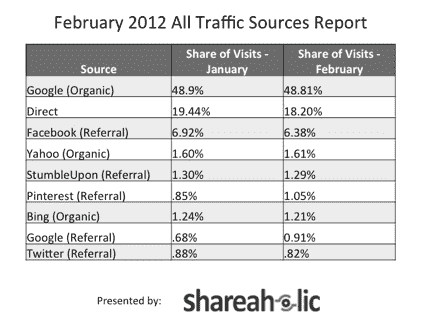

# Pinterest 现在产生的推荐流量超过 Twitter:研究 

> 原文：<https://web.archive.org/web/https://techcrunch.com/2012/03/08/pinterest-now-generates-more-referral-traffic-than-twitter-study/>

# 研究显示，Pinterest 现在产生的推荐流量超过了 Twitter

这很重要。

在线分享工具 Shareaholic 的一项新研究发现，Pinterest 现在比 Twitter 带来了更多的推荐流量。再次，谈到推荐流量，Pinterest >、T2【Twitter。

该数据基于对 200，000 家出版商的分析，这些出版商每月有大约 2.7 亿独立访问者。

现在，早在二月份【Pinterest 在推荐流量上超过 Google+，YouTube 和 LinkedIn *加起来*是一个大新闻[，但是 Twitter 已经成为一个事实上的分享网络，拥有大量的网址缩写和实时、简洁的信息流。](https://web.archive.org/web/20221219210617/http://mashable.com/2012/02/01/pinterest-traffic-study/)

尽管如此，Pinterest 在过去一个月内缩小了差距，从 1 月到 2 月，推荐流量访问的份额从 0.85%下降到 1.05%。社交网站 pinboard 现在落后于脸书和 StumbleUpon。记住，Pinterest 仍然只接受邀请。

