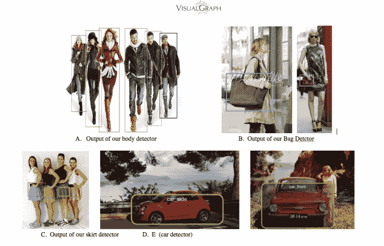

# Pinterest 收购图像识别和视觉搜索初创公司 Visual graph 

> 原文：<https://web.archive.org/web/https://techcrunch.com/2014/01/06/pinterest-visualgraph/>

Pinterest 刚刚收购了两家初创公司 [VisualGraph](https://web.archive.org/web/20230205031654/http://www.visualgraph.com/) ，该公司创造了机器视觉、图像识别和视觉搜索技术。公司创始人 Kevin Jing 和他的合伙人今天加入了 Pinterest 工程团队。

Pinterest 表示“收购 VisualGraph 将帮助我们建立技术，以更好地了解人们在钉什么。我们希望通过这样做，让人们更容易找到自己喜欢的东西。”

通过了解人们所发布的视觉内容，Pinterest 可以建议其他内容或向人们展示更多相关广告。例如，即使没有文本或标签，如果你钉了很多长裙，VisualGraph 可以帮助 Pinterest 识别服装的形状，并让它知道向你显示类似的服装，而不是短裙。你可以在下面的图片中看到 VisualGraph 的图像检测技术。

目前，Pinterest 正在制定一项[盈利战略](https://web.archive.org/web/20230205031654/https://techcrunch.com/2013/09/19/pinterest-ads/)，预计将专注于广告。让这些广告成为服务的一个无缝部分，并具有足够的影响力来赚取大笔的钱，将需要它们与观众高度相关。机器视觉和图像识别可以帮助 Pinterest 将广告与锁定和查看类似商品的用户匹配起来。

想象一下谷歌的“图片搜索”系统是如何工作的，你上传一张图片，然后得到看起来像它的图片。Pinterest 也可以提供类似的功能，或者扫描你上传的所有东西，为你喜欢的东西建立一个秘密文件。

一点也不牵强。事实上，谷歌的视觉搜索功能正是 VisualGraph 首席执行官 Kevin Jing 在 2004 年加入谷歌后一直致力于开发的。VisualGraph 的员工刘中达在斯坦福大学攻读计算机科学硕士学位时加入了这家初创公司，此前他曾在谷歌、Palantir 和脸书实习。

根据景在 LinkedIn 上的简介，他和 VisualGraph 一起“领导一个工程团队在 AWS 上建立一个大规模、内存、分布式视觉搜索引擎，并应用于视觉购物。与最先进的物体识别系统相比，速度提高了 8 倍，人脸检测精度与 face.com 的脸书和谷歌相当。”

关于购物的部分应该会刺激投资者，他们急于看到它将如何兑现迄今为止筹集的 5.64 亿美元风险投资。

通过使 Pinterest 更容易通过视觉搜索导航，人们可以更像一个购物网站，而不是灵感发现时间池。有搜索的地方，就有相关广告的空间，这些广告击中了已经有购买意向的人——这对 Pinterest 来说可能非常有利可图。

在 VisualGraph 网站上的一份声明中，该公司写道:

> 并非所有的图片都是平等的:虽然每天都有数十亿张照片被分享，但其中只有一部分(如艺术和手工艺、流行设计)有潜力激励、吸引和鼓舞大量的人。如果所有世界的图像以某种方式连接成一个图，这些将是最特殊的节点。
> 
> 我们在 VisualGraph 的使命是将这些鼓舞人心的图像联系在一起。虽然单个图像可以吸引人并激发灵感，但一个连接的图像网络可以大规模地激发灵感、探索和发现。我们的方法是将最先进的机器视觉工具(如物体识别(如鞋子、人脸))与大规模分布式搜索和机器学习基础设施相结合。
> 
> 今天，我们非常激动地宣布，我们将加入 Pinterest！
> 
> 在 Pinterest 上，每天有数百万人在整理和分享数十亿个大头针。这些大头针不仅仅是图像，它们还链接到可以激励和丰富人们生活的内容。我们很高兴有机会将机器视觉与人类视觉和策展结合起来，并建立一种视觉发现体验，这种体验既具有美学吸引力，又对世界各地的人们非常有用。
> 
> 我们要感谢支持我们的员工、承包商、顾问和投资者。我们今天将加入 Pinterest，迫不及待地想知道接下来会发生什么！
> 
> 如果你有兴趣加入我们的努力，请[给我们发一封](https://web.archive.org/web/20230205031654/http://about.pinterest.com/careers/) [的短信](https://web.archive.org/web/20230205031654/http://about.pinterest.com/careers/) — Kevin Jing，