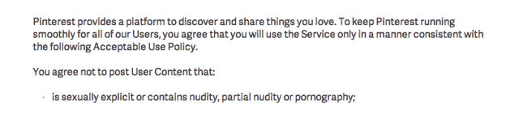
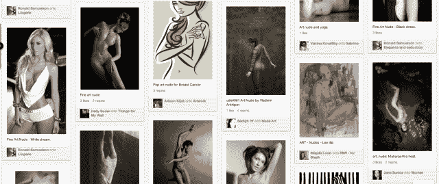

# Pinterest 正在寻找允许正确类型的裸体(即艺术，而不是色情)的方法

> 原文：<https://web.archive.org/web/https://techcrunch.com/2013/05/30/pinterests-arty-nudes/>

# Pinterest 正在寻找允许正确类型的裸体(也就是艺术，而不是色情)的方法

Pinterest 正在与自己过于现代的可接受的使用政策的界限发生摩擦。这个让人们分享他们真正喜欢的东西的图片的社交网站告诉英国《金融时报》,它计划允许用户发布更多的裸体图片——此前艺术家和摄影师抱怨其目前的裸体禁令。

Pinterest 目前的[可接受使用政策](https://web.archive.org/web/20221007002057/http://about.pinterest.com/use/)中的第一条就是不裸露:

然而，该公司昨日向英国《金融时报》表示，在艺术裸体画方面，它计划放松最上面的按钮。“Pinterest 是关于表达你的激情，人们对艺术充满热情，这可能包括裸体。因此，我们将努力适应这一点，”它告诉报纸。

更重要的是，它可能没有太多选择。在 Pinterest 上搜索艺术裸体画，并不缺少艺术裸体画——坦率地说，只是穿着暴露——内容已经被钉上了。因此，该网站很可能只是对用户已经在做的事情做出反应。

监管用户生成的内容始终是一个巨大的挑战——脸书最近发现自己因基于性别的仇恨帖子而陷入困境。该社交网络成为一个反性别歧视运动组织的目标，因为它未能删除煽动强奸和性仇恨的暴力厌恶女性的帖子。

活动组织[“日常性别歧视项目](https://web.archive.org/web/20221007002057/http://www.everydaysexism.com/)”瞄准了在攻击性帖子旁边出现广告的脸书广告商，敦促他们撤回广告，直到内容被删除。许多广告商都这样做了，本周早些时候，脸书的安全团队发布了一条[更新](https://web.archive.org/web/20221007002057/https://www.facebook.com/notes/facebook-safety/controversial-harmful-and-hateful-speech-on-facebook/574430655911054)消息称，他们打算审查和更新识别和删除基于性别的仇恨言论的指导方针。因此，虽然用户生成的内容可能是推动您业务发展的一种低成本方式，但如果管理不当，显然也会造成严重损害。

回到 Pinterest，该网站对图像的关注使其成为对艺术感兴趣的人的天然家园——这使其当前可接受的使用政策有点太不灵活。艺术史中没有删除人体的形式，所以通过允许一些裸体来解放可接受的用法是很有意义的。Pinterest 面临的挑战将是保持足够的整洁，不至于吓跑那些不那么附庸风雅、更专注于家庭自制的用户——他们希望看到纸杯蛋糕的别针，而不是，你知道，纸杯蛋糕。

我们已经联系了 Pinterest，询问它具体计划如何修改和执行一项新的、更有利于裸体的政策——而不打开更多核心成人内容的闸门——并将根据任何回应更新这个故事。

当然，色情问题也在 Tumblr 上抬头——但这并没有阻止[雅虎！从花 11 亿美元收购所有 UGC](https://web.archive.org/web/20221007002057/https://beta.techcrunch.com/2013/05/20/its-official-yahoo-is-buying-tumblr-for-1-1b-promises-to-keep-it-independent/) ，甚至是 NSFW 的部分。