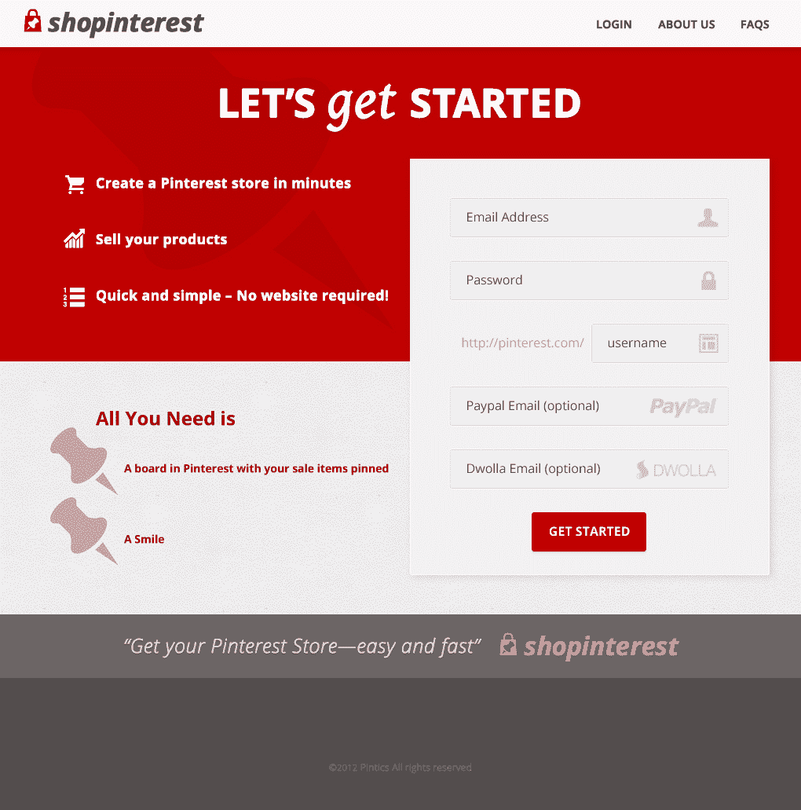
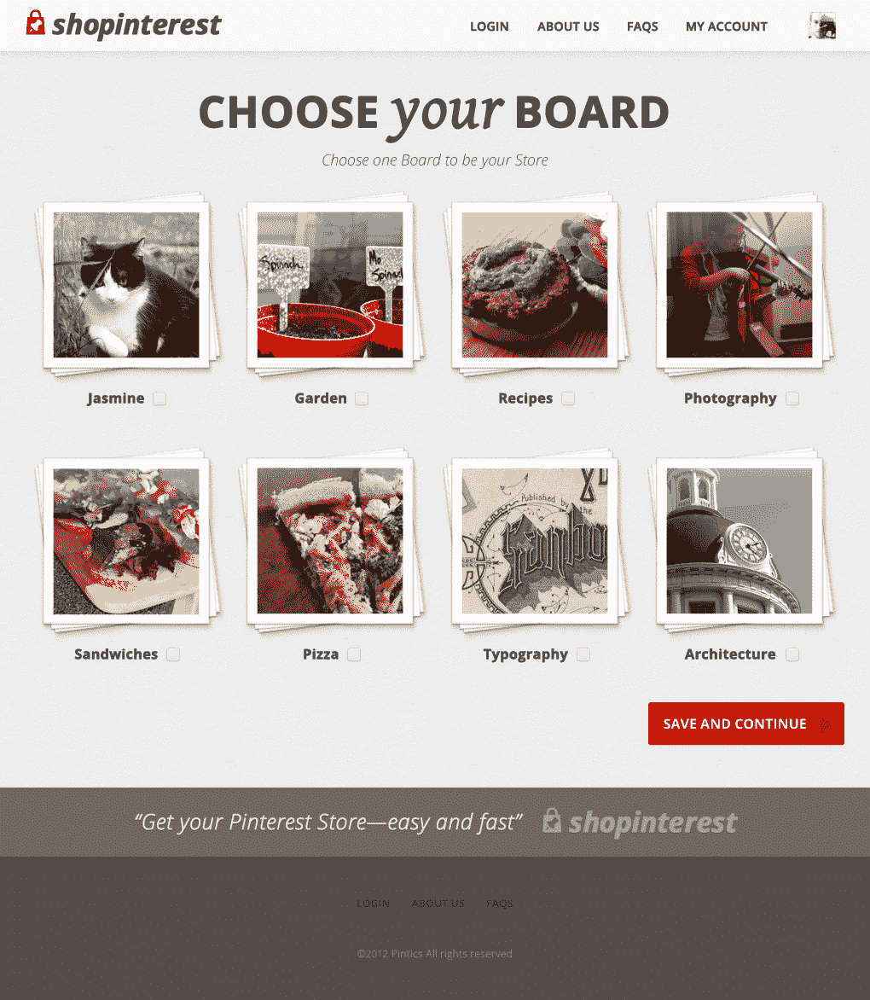
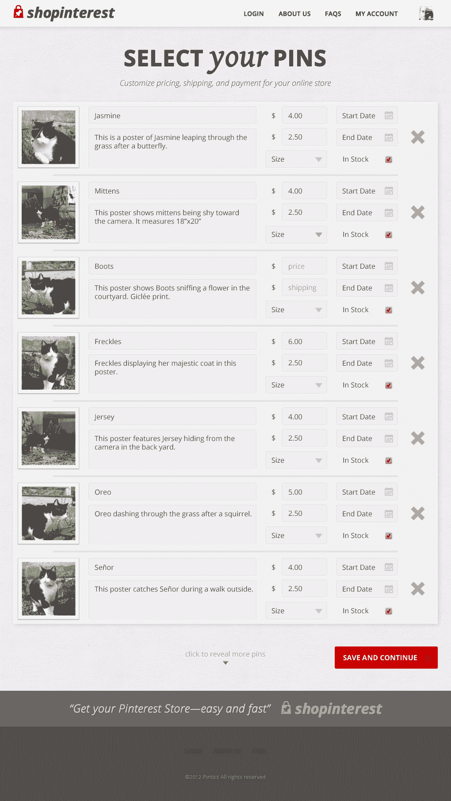
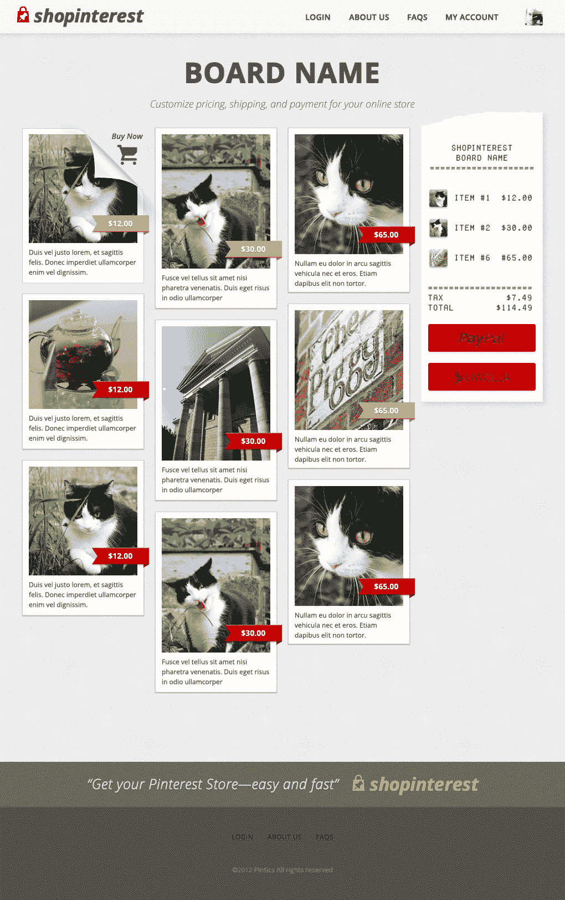
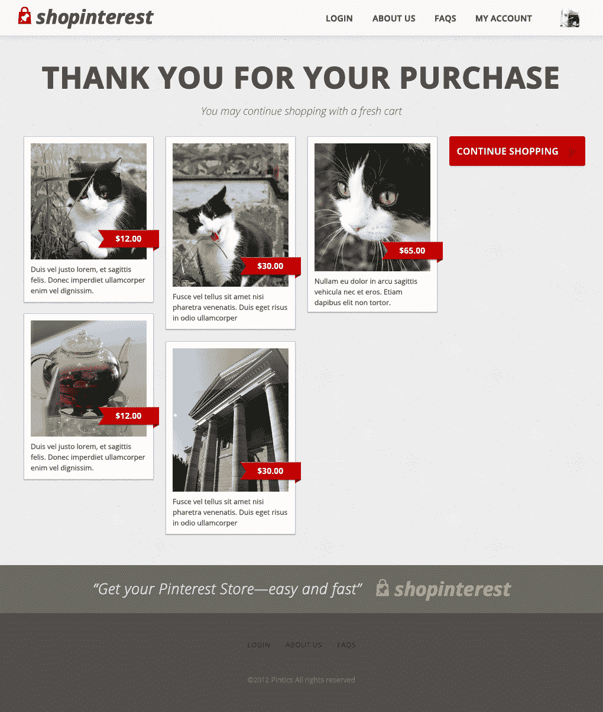

# Pintics 的创始人创建了 ShopInterest，这是一个“pInterest 的 Shopify”

> 原文：<https://web.archive.org/web/https://techcrunch.com/2012/06/25/pintics-founders-create-shopinterest-a-shopify-for-pinterest/>

# Pintics 的创始人创建了“为 pInterest 购物”的 Shopify

创建 Pinterest 分析服务 [Pintics](https://web.archive.org/web/20221007144822/http://signup.pintics.com/) 的同一批人在帕洛阿尔托的 AngelHack 黑客马拉松上度过周末，从事另一个与 Pinterest 相关的项目。这一次，结果是[的 ShopInterest](https://web.archive.org/web/20221007144822/http://signup.shopinterest.co/) ，这是一项 DIY 服务，任何人都可以把他们的 pInterest 板变成在线商店。例如，受 Fab.com 等网站上蓬勃发展的社交购物趋势的启发，ShopInterest 将你的精选 pin 收藏转变为包含集成购物车体验的网络商店。该公司解释说，这是“Pinterest 的 Shopify”。

Pintics 首席执行官弗朗西斯科·格雷罗(Francisco Guerrero)表示，ShopInterest 不是 Pintics 的“支点”——他说，另一项服务仍然表现良好，目前正在跟踪与 75 万个 pin 相关的分析。相反，Pintics 和 ShopInterest 这两个服务面向不同的受众。“我们的 Pinterest 分析服务面向大型电子商务公司，”格雷罗说，“但在我们看到通过 Pinterest 产生的大量销售额后，我们决定帮助普通用户分享乐趣和利润。”

首先，用户只需登录，选择展示其产品的展示板，添加描述、价格和运费，然后选择他们希望如何获得支付(PayPal 或 Dwolla)。其余的设置由 ShopInterest 自己处理。它看起来也不太破旧——尤其是考虑到它建造的速度有多快。格雷罗周日表示:“我们累了，我们饿了，我们在过去的 36 个小时里没有睡觉，但我们很高兴这个辅助项目看起来非常好。”。

这个项目是 Pintics 的联合创始人弗朗西斯科·格雷罗(Francisco Guerrero)和与设计师汤姆·哈金斯(Tom Hodgins)、沙溢·彭(音译)和孙建青(音译)合作完成的，这并不是第一次有人利用第三方试图从该网站上所有的社交图片分享中获利。该网站目前是仅次于脸书和 Twitter 的第三大最受欢迎的社交网络。最引人注目的是，今年二月，据透露 Pinterest 本身已经为网络出版商试验了 [SkimLinks 的内容货币化平台](https://web.archive.org/web/20221007144822/https://beta.techcrunch.com/2012/03/20/skimlinks-releases-full-api-for-web-publishers/)，每年大概能赚 1 万到 2 万美元。但是[有消息称](https://web.archive.org/web/20221007144822/https://beta.techcrunch.com/2012/02/17/pinsanity/) Pinterest 对收入不感兴趣，而是对提供的分析链接更感兴趣。

但是，Pinterest 并没有通过 ShopInterest 产生一百万个这样的其他努力，这与该服务仍然缺乏公共 API 的事实有更大的关系。(文档在网上发布过—[细节在这里存档](https://web.archive.org/web/20221007144822/http://www.programmableweb.com/api/pinterest)——所以我们知道有一个文档存在。)为了解决这个问题，Pintics 团队必须有点创意。“RSS feed 是可解析的，包含了我们需要的基本信息，”Guerrero 指出，他指的是其中一次黑客攻击。但是，他补充道，“就像其他人一样，我们正在等待 Pinterest 提供完整的 API，以实现更多已经计划好的功能。”

目前， [ShopInterest](https://web.archive.org/web/20221007144822/http://signup.shopinterest.co/) 位于 LaunchRock 注册页面之后，但你可以在下面的视频中看到它的运行。

【YouTube = http://www . YouTube . com/watch？v=JlfdTz-aDwU&w=640&h=360]

