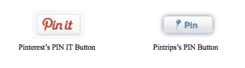
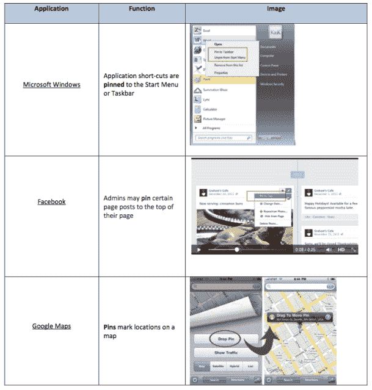

# Pintrips 提出动议驳回 Pinterest 的商标诉讼，称“Pin”过于普通 

> 原文：<https://web.archive.org/web/https://techcrunch.com/2014/01/09/pintrips-pinterest-trademark/>

别针，到处都是别针！早在 10 月份，我们报道了 [Pinterest](https://web.archive.org/web/20221208025908/http://www.pinterest.com/) 对策划旅游初创公司 [Pintrips](https://web.archive.org/web/20221208025908/http://www.pintrips.com/) 提起的[商标侵权诉讼](https://web.archive.org/web/20221208025908/https://beta.techcrunch.com/2013/10/04/pinterest-files-a-trademark-suit-against-social-travel-startup-pintrips-claims-pinning-buttons-confusingly-similar/)，指控其商标侵权、虚假指定原产地、不正当竞争和商标淡化。现在 Pintrips 开始反击了。它提出了一项驳回的动议，理由有二:首先,“pin”一词过于笼统；其次，Pinterest 因此提出了理由不充分的索赔。

这些是问题中的别针纽扣，来自 Pinterest 原始套装中的一张图片:

平特里普斯向美国加州北区地方法院提交的驳回动议如下。

这一进展正值 Pinterest 在商标方面面临又一次挫折之际。上个月，欧洲一家法院裁定[它不拥有“Pinterest”](https://web.archive.org/web/20221208025908/https://beta.techcrunch.com/2014/01/02/pinterest-loses-trademark-claim-in-europe-to-premium-interest-a-social-news-aggregator/)这个词的商标——一家总部位于伦敦的名为 Premium Interest 的初创公司拥有。Pinterest 的一名发言人告诉我们，该公司将对此案提起上诉。

在 Pintrips 的案例中，这家初创公司正在以大卫对抗歌利亚的方式进行复仇。

pintrips——比风险投资支持的 Pinterest 小得多，现在价值近 40 亿美元——指责它掠夺了不在同一社交媒体空间的“努力工作的创业公司”;并因其未能保护通用词的商标而采取法律行动。从西装上看:

> “原告因未能获得‘pin’一词的美国商标注册而感到沮丧，并知道它不能主张‘pin’一词的商标权，因此诉诸于起诉 Pintrips，Inc .(‘Pintrips’)，一家努力工作的初创公司，提出了似是而非的索赔。Pintrips 不是一个社交媒体平台。这是一个在线旅行规划工具，允许用户查看和监控商业航班的信息 Pintrips 的部分功能[正如我们在之前[所写的]是基于允许用户在规划旅行安排时虚拟锁定航班。这个投诉是一个教科书般的例子，一个行业巨头利用虚假诉讼迫使一个小实体放弃使用一个通用术语的权利，该术语仅仅描述了其服务的核心功能。"](https://web.archive.org/web/20221208025908/https://beta.techcrunch.com/2013/04/16/pintrips-launches-a-collaborative-trip-planning-dashboard-for-tracking-flights-prices-across-destinations-in-real-time/)

然而，Pinterest 似乎直接驳斥了关于“pin”一词注册的这一说法的核心部分。它指出，它的申请已经获得批准(但尚未注册):

“我们的重点是防止消费者混淆和保护我们的商标，”一位发言人告诉我。“为了实现这个目标，Pinterest 已经在几个国家注册了 PIN 的商标，美国专利商标局已经批准了 Pinterest 的商标申请，承认 PIN 有利于 Pinterest 的可保护性。”

Pintrips 提出了许多其他观点，它认为这些观点反对 Pinterest 声称拥有“pin”一词的所有权。

首先，已经有许多其他更大的在线服务免费使用这个词，没有来自 Pinterest 的法律压力。它们包括微软、谷歌和脸书:

Pintrips 的律师指出，从“普遍和普遍的使用中删除像“pin”这样的“通用术语，以便单个公司可以获利”是违反法律的。但即便如此，仍有许多公司已经获得了包含“pin”一词的商标，这再次暗示这些公司已经与 Pinterest 共存。那些公司包括 Pinny，Pinwheel，Pinning Party(我的最爱)和 Pinsync。

美国在线(TC 的母公司)甚至出现在另一部分的动议中，Pintrips 的律师试图从其他例子中证明，听起来太通用的词在过去没有获得商标。对 AOL 来说，它的致命弱点是“你有邮件”

平特里普斯的律师写道:“普通的日常表达一再被剥夺商标地位，因为它们是信息短语，而不是来源的指示，因此这种表达仍然可供所有人自由使用。”

Pinterest 吸引用户的部分原因是它的可访问性，这得益于它是围绕非技术和非虚拟的概念(如插针板和插针)构建的。Pinterest 现在有 3.38 亿美元的资金，现在有大量的资源来保护其品牌免受那些试图模仿其概念和成功的人的影响。现在的问题是，它是否选择了正确的战斗，以及 Pintrips(或者在欧洲，溢价利息)是否真的会阻碍其业务的发展。

图片: [Flickr](https://web.archive.org/web/20221208025908/http://www.flickr.com/photos/rnddave/8728735876/sizes/c/)

[scribd id = 197877254 key = key-QA i3 LFY 6 Liu wj 4 bdgjc mode = scroll]