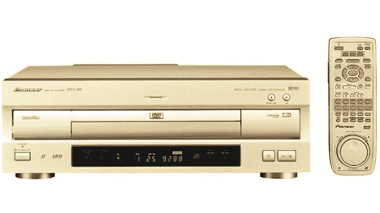
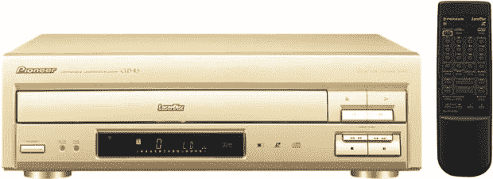

# 先锋在日本销售另一批激光唱盘播放器 

> 原文：<https://web.archive.org/web/https://techcrunch.com/2009/07/29/pioneer-sells-another-batch-of-laserdisc-players-in-japan/>

# 先锋在日本销售另一批激光唱机

还记得[激光唱片](https://web.archive.org/web/20221001212735/http://en.wikipedia.org/wiki/Laserdisc)吗？那些八九十年代日本以外几乎没人买的大尺寸视频介质？我从来没有想过我会在今年一月报道[先锋永远停止生产](https://web.archive.org/web/20221001212735/http://www.crunchgear.com/2009/01/14/pioneer-pulls-the-plug-on-ld-production/)LDs 播放器之后再写一篇关于 LDs 的文章。

但是昨天，同一家公司(生产最好的硬件)发布了一份新的新闻稿，称其仍有一些库存，DVL-919(1000 美元，见上图)和 CLD-R5(400 美元，见下图)。主要区别在于，R5 只能播放 LD 和 CD，而 919 也可以播放 DVD(区域 2)。

LD 粉丝只能在[先锋日本的网店](https://web.archive.org/web/20221001212735/http://www3.pioneer.co.jp/online/index.php?CATETCD=110&CATEMCD=153&mode=PD-LIST2)【JP】购买玩家。住在日本以外的铁杆用户可能会想让 Geek Stuff 4 U 为他们弄一个。这可能是购买全新设备的最后机会之一。