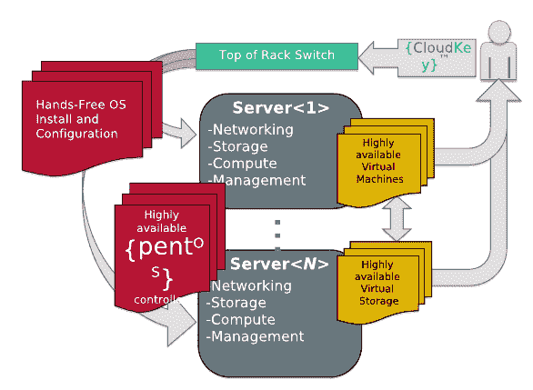

# Piston Cloud 推出 pentOS，这是一款企业 OpenStack 发行版 TechCrunch

> 原文：<https://web.archive.org/web/http://techcrunch.com/2011/09/26/piston-cloud-launches-pentos-an-enterprise-openstack-distribution/>

[Piston Cloud Computing，Inc.](https://web.archive.org/web/20230204103444/http://www.pistoncloud.com/) 今天从秘密行动中脱颖而出，推出新的面向私有云的企业级云操作系统，名为 [pentOS](https://web.archive.org/web/20230204103444/http://www.pistoncloud.com/product) 。新的操作系统建立在 [OpenStack](https://web.archive.org/web/20230204103444/http://www.openstack.org/) 之上，这是一个开源的 IaaS 云计算项目，目前已有超过 1450 名贡献者和 110 家参与公司，包括 NASA、Rackspace、Citrix、英特尔、思科、Arista Networks、微软和戴尔。

pentOS(OSTM 活塞企业)的重点是私有云环境，这是在当今的 OpenStack 环境中被忽略的一个领域。新操作系统解决了企业最迫切的问题，包括安全性、合规性以及与现有系统的集成。

首先，与 OpenStack 不同，OpenStack 是一个云自动化层，而不是一个操作系统， [pentOS](https://web.archive.org/web/20230204103444/http://www.pistoncloud.com/product) 是裸机，构建在一个强化的 Linux 发行版上，除了运行 open stack 所需的内容之外，它不包含任何内容。它还包括业内首次实现的 [CloudAudit](https://web.archive.org/web/20230204103444/http://cloudaudit.org/) ，这是一个于 2010 年初推出的跨行业标准，旨在自动化审核云服务提供商的流程，并已成为 OpenStack 的安全标准。

此外，pentOS 附带 Piston CloudKey，本质上是一个 u 盘，允许您编辑单个配置文件来更改私有云。当您准备好部署这些更改时，只需将 USB 闪存盘插入交换机，交换机就会自动将软件安装到服务器上。Piston Cloud 表示，这是一个 99.99%自动化的免手动安装。

[PentOS](https://web.archive.org/web/20230204103444/http://www.pistoncloud.com/product) 基于开放标准，其设计与供应商无关。它支持各种交换机和服务器。目前支持 Arista 交换机，但惠普和 Force10 的交换机将很快支持。它还可以与其他公共或私有云环境一起运行，包括 Rackspace、戴尔、亚马逊、Internap、韩国电信等公司的云环境。

该软件将于 10 月 3 日开始提供预览版，并将于 11 月 29 日上市。许可将基于每台服务器，订阅包将包括年度支持。定价尚未确定。

Piston Cloud 的首席执行官兼联合创始人 Joshua McKenty 是美国宇航局星云云计算平台的技术负责人和云架构师，该平台构成了 OpenStack 项目的基石。他目前是 OpenStack 项目政策委员会的指定成员。与此同时，Piston Cloud 的首席技术官兼联合创始人克里斯托弗·麦克格姆(Christopher mackomber)是 Slicehost 的技术负责人，该公司于 2008 年被 Rackspace 收购。

该公司[在 7 月份的首轮融资中筹集了 450 万美元](https://web.archive.org/web/20230204103444/http://www.businesswire.com/news/home/20110711006971/en/Piston-Cloud-Computing-Raises-4.5-Million-Open)，由 Hummer Winblad 和 True Ventures 牵头，Divergent Ventures 和其他公司参与。