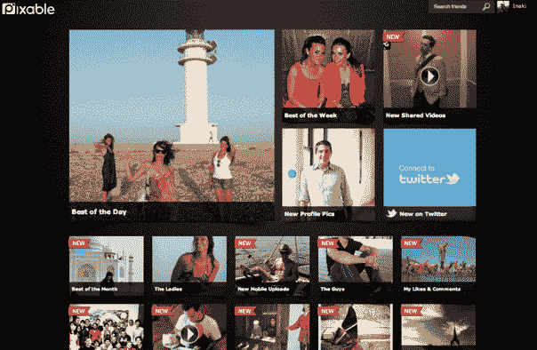

# Pixable 将 Twitter 加入智能社交照片和视频聚合器 

> 原文：<https://web.archive.org/web/http://techcrunch.com/2011/08/24/pixable-adds-twitter-to-intelligent-social-photo-and-video-aggregator/>

# Pixable 将 Twitter 加入智能社交照片和视频聚合器

[Pixable，](https://web.archive.org/web/20230203071612/http://www.pixable.com/)一家开发时尚社交照片创建和分类工具的初创公司，正在将 Twitter 上的图片整合到其智能社交照片和[视频](https://web.archive.org/web/20230203071612/https://techcrunch.com/wp-admin/post.php?post=394762&action=edit)聚合服务中。

Pixable 的 [Photofeed](https://web.archive.org/web/20230203071612/https://techcrunch.com/2011/01/11/pixables-photofeed-sorts-and-categorizes-your-facebook-photos/) 是一款脸书应用和配套的移动应用，可以智能地对你朋友的脸书、Instagram 和 Flickr 照片以及脸书、Vimeo 和 YouTube 视频进行分类。

显然，将 Twitter 加入其中是有意义的。因此，一旦你用你的 Twitter 凭证登录 Pixable，除了你在脸书的朋友分享的照片和视频之外，这项服务还会播放你在 Twitter 上关注的朋友分享的照片和视频。该应用程序将照片组织到一个定制的 feed 中，该 feed 来自 Twitter 的原生照片服务，以及从 TwitPic、yFrog、Instagram、Picplz、Lockerz、Vimeo 和 YouTube 等其他服务共享到 Twitter 的内容。

Pixable 创始人伊纳基·贝朗吉耶表示，随着 Instagram 等服务越来越受欢迎，以及 Twitter 与 iOS 5 的深度整合，社交照片分享不断增加，用户需要一个智能平台来整理图像和视频。投资者似乎也这么认为；Pixable [刚刚从 Menlo Ventures 和其他人那里筹集了](https://web.archive.org/web/20230203071612/https://techcrunch.com/2011/04/22/social-photo-aggregator-pixable-raises-3-6-million/)360 万美元。