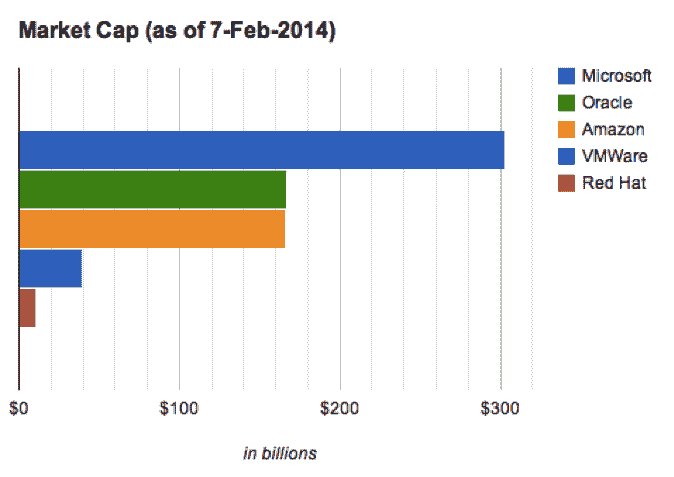

# 为什么永远不会有另一个红帽:开源经济学

> 原文：<https://web.archive.org/web/https://techcrunch.com/2014/02/13/please-dont-tell-me-you-want-to-be-the-next-red-hat/>

More posts by this contributor

编者按: *彼得·莱文是安德森·霍洛维茨律师事务所的合伙人。他是麻省理工学院和斯坦福大学商学院的讲师，也是 XenSource 的前首席执行官，该公司于 2007 年被 Citrix 收购。在加入 XenSource 之前，Peter 是 Veritas Software 的战略和平台运营副总裁，他帮助该公司从零收入发展到超过 15 亿美元，从 20 名员工发展到超过 6，000 名员工。在他的[博客](https://web.archive.org/web/20230405105459/http://peter.a16z.com/)和推特 [@Peter_Levine](https://web.archive.org/web/20230405105459/https://twitter.com/Peter_Levine) 上关注他。*

开源软件推动了世界科技的发展。在过去的十年中，在计算的大多数方面，开源已经不可阻挡地被采用。没有开源，脸书、谷歌、亚马逊和几乎所有其他现代科技公司都不会存在。由于一个由创新、顶尖程序员组成的令人惊叹的社区，开源已经成为云计算、软件即服务、下一代数据库、移动设备、消费互联网甚至比特币的基础。

然而，在这种势头下，有一部分软件业内人士大声宣扬开源软件在与专有软件供应商的竞争中即将失败。他们认为，开源软件的未来将被视为平庸的软件，被归入利基项目。专有软件供应商将处理真正关键的东西。

那到底是哪个？技术公司使用开源的成功，以及开源的明显失败是一个令人挠头的问题。然而，两者都是真的，但不是出于某些人想让你相信的原因。开源的成败不在于软件本身——它肯定取决于它所需要的任务——而在于底层的商业模式。

## **以红帽**开始(也结束)

Linux 操作系统公司 Red Hat 开创了原始的开源商业模式。Red Hat 免费提供开源软件，但对那些依赖 Red Hat 进行维护、支持和安装的客户收取支持费。随着收入开始进入 Red Hat，创业公司之间开始了一场竞赛，为每个专有软件副本开发开源产品，然后围绕它包装 Red Hat 风格的服务产品。MySQL、XenSource、SugarCRM、Ubuntu 和 Revolution Analytics 等公司就是在这股开源热潮中诞生的。

Red Hat 是一家了不起的公司，是成功商业化开源的先驱。然而，从商业角度来看，除了 Red Hat 之外，这种努力基本上是失败的。考虑到“支持”模式已经存在了 20 年，除了 Red Hat 之外，没有其他独立的上市公司能够提供其专有对手的替代方案。当你将红帽的市值和收入与微软、亚马逊或甲骨文相比时，即使是红帽也开始显得不冷不热。Linux 的压倒性成功与红帽的表现不成比例。对开源来说很棒，对红帽来说有点失望。

红帽模式不起作用的原因有很多，但其失败的关键在于商业模式无法为持续投资提供充足的资金。这种模式的结果是最小的产品差异，导致有限的定价能力和相应的收入不足。如下所示，开源支持模式产生的收入只是其他许可模式的一小部分。因此，像微软、甲骨文或亚马逊这样的公司那样对产品开发、支持或销售进行适当投资几乎是不可能的。

如果这还不够困难，纯粹的开源公司还有其他不利因素。产品路线图和需求通常留给分散的开发团队。除非某个公司雇佣了某个特定开源项目的大部分发明者，否则这个项目很可能永远不会取得进展，或者另一家公司决定创建一个技术分支。定义和控制一个稳定的路线图的复杂性与足够快地创新以防止分叉的复杂性相比，对于小型组织来说是有害和复杂的。

更糟糕的是，一个开源项目越成功，越多的大公司想要吸收代码库。作为 XenSource 的首席执行官，我亲身经历了这一点，在 XenSource，每一家主要的软件和硬件公司都利用我们的代码库，而我们几乎没有收入。我们把产品做得如此简单易用，如此重要，以至于我们超越了自己。这对开源社区来说很好，但对我们来说就不那么好了。

如果你认为这是过去的历史，不相关，我看到类似的情况发生在今天的 OpenStack 上，并且很可能发生在许多其他成功的开源项目上。作为一个开源公司，你不仅仅是在和专利公司竞争，你也是在和开源社区本身竞争。这是一场名副其实的狗屎秀。

如果你很幸运，有一个超级成功的开源项目，也许一个大公司会付给你几美元作为一次性支持，或者让你建立一个“shim”或“foo”或“bar”如果你真的很幸运(就像我们在 XenSource 时一样)，你可能会被作为“战略性”收购而被收购。但是，大多数开源公司没有这种运气，上市并创建大型独立公司的机会非常渺茫。

即使所有这些都对他们不利，我们仍然看到企业家将他们的公司标榜为“下一个……的红帽子”。这种观点的问题在于:从来没有“下一个……的红帽子”。这并不是说我们不会看到另一个红帽子，但可能性很大，道路上布满了尝试过这种支持模式的公司的尸体。

但是有一种模式是可行的。

## **销售开源服务**

获胜的开源模型颠覆了开源 1.0。通过将开源打包成服务(如在云计算或软件即服务中)或软件或硬件设备，公司可以通过一个更加健壮和灵活的模型将开源货币化，鼓励创新和对软件开发的持续投资。

当今许多最成功的新公司都依赖于标准化开源组件的生态系统，这些组件通常被整个行业重用和更新。使用这些开源构件的公司非常乐意为他们正在取得的成功做出贡献。这些开源构建模块是所有现代云和 SaaS 产品的基础，在许多情况下，它们被很好地货币化了。

根据公司和产品的不同，一个组织可能会开发更多针对其业务的开源软件，或者构建一些专有软件来完成产品供应。亚马逊、脸书、GitHub 和许多其他公司将开源组件与他们自己的专有代码混合在一起，然后将这种组合作为服务出售。

这种方法——将开源与服务或设备模型相结合——正在软件领域产生惊人的结果。云和 SaaS 的采用速度比内部部署快一个数量级，开源是这一转变的推动者。

除了 SaaS，我预计未来还会有开源货币化的模式，这对整个行业来说都是好事。

你还在等什么？

在和*的基础上围绕*一个成功的平台建立一个大企业*，加入一些你自己的东西，既充实又与众不同。以我们的国家道路和高速公路系统为例。如果你将它视为*运输平台，你会开始看到许多高度差异化的企业建立在它的基础上，从联邦快递到特斯拉。拼车服务 Lyft 正在同一运输平台以及亚马逊的 AWS 平台上开展业务。**

 *如果你扩展这个平台的世界观，Red Hat 的支持模式相当于出售稍微好一点的版本——在这种情况下，是 Linux 操作系统——对大多数人来说已经足够好了。

当然，当你第一次启动使用开源组件构建的业务时，扩大平台的规模并迎合早期采用者以推动最初的成功是很重要的。所以你可能开始看起来有点像红帽。但如果一切顺利，你将开始变得更像脸书、GitHub、亚马逊或 Cumulus Networks，因为你将自己的特殊东西放在平台之上，并将其作为服务交付，或将其打包为设备。成为下一个红帽是一个令人钦佩的目标，但当你看看今天的趋势，也许甚至红帽应该考虑成为下一个亚马逊。

图片来自[Shutterstock](https://web.archive.org/web/20230405105459/http://www.shutterstock.com/)*