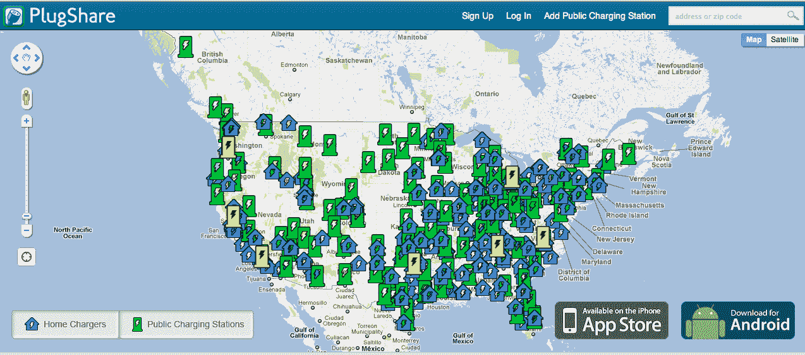

# PlugShare 是 Getaround 的合作伙伴，为共享汽车的会员提供 50 美元 TechCrunch

> 原文：<https://web.archive.org/web/http://techcrunch.com/2011/10/14/plugshare-partners-with-getaround-offers-members-50-for-sharing-their-car/>

# PlugShare 是 Getaround 的合作伙伴，为共享汽车的会员提供 50 美元

软件公司 [PlugShare](https://web.archive.org/web/20230203143121/http://www.plugshare.com/) ，为电动汽车车主提供应用程序的制造商，今天宣布与汽车共享服务公司(和[TechCrunch Disrupt NYC winner](https://web.archive.org/web/20230203143121/https://techcrunch.com/2011/05/25/and-the-winner-of-techcrunch-disrupt-nyc-is-getaround/))[Getaround](https://web.archive.org/web/20230203143121/http://www.getaround.com/)合作，向那些通过 get around 服务注册共享汽车的 PlugShare 会员提供 50 美元。

这一想法的推出恰逢有史以来第一个“全国充电日”，旨在促进点对点共享，被认为在扩大电动汽车的采用和基础设施方面发挥着至关重要的作用。

[全国插电式汽车日](https://web.archive.org/web/20230203143121/http://www.pluginamerica.org/pluginday)(2011 年 10 月 16 日，星期日)是一项在美国 20 多个城市开展的提高意识活动，希望引起人们对插电式电动汽车的环境和经济效益的关注。在美国，塞拉俱乐部和电动汽车协会将联手提供插电式游行，尾门派对，试驾等活动。

PlugShare 的创始人将于本周日上午 11:30-下午 2:30 在 Chrissy Field 参加旧金山当地的国家充电日庆祝活动，与 Getaround 和充电日赞助商的领导一起倡导采用电动汽车。

由于 Getaround 目前的可用性，50 美元的财政奖励将仅适用于旧金山湾区和圣地亚哥大都会区的居民。

PlugShare 还宣布推出其新的网络应用程序，该应用程序现在加入了 iPhone 和 Android 应用程序，成为访问该公司维护的大型公共和私人充电站列表的又一工具。你可以在 www.plugshare.com/widget[预览这个网络应用。](https://web.archive.org/web/20230203143121/http://www.plugshare.com/widget/widget.html)

