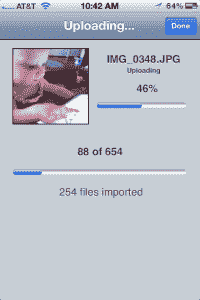

# Pogoplug Cloud 发布，为移动用户提供 5 GB 免费存储 

> 原文：<https://web.archive.org/web/https://techcrunch.com/2011/11/14/pogoplug-cloud-launches-with-5-gb-of-free-storage-for-mobile-users/>

云存储服务和设备制造商 [Pogoplug](https://web.archive.org/web/20230205014414/http://www.pogoplug.com/) 今天发布了其最新产品:一项为移动用户提供 5 GB 免费在线存储的新服务。要使用“Pogoplug Cloud”，你首先要直接从手机或平板电脑( [iOS](https://web.archive.org/web/20230205014414/http://itunes.apple.com/us/app/pogoplug/id306217576?mt=8) 或 [Android](https://web.archive.org/web/20230205014414/https://market.android.com/details?id=com.pogoplug.android&feature=search_result#?t=W251bGwsMSwyLDEsImNvbS5wb2dvcGx1Zy5hbmRyb2lkIl0) 2.2+)注册，然后下载应用程序并开始上传过程。

这就是 Pogoplug 真正开始发光的地方:它*自动*将照片和视频从你的设备上传到云端——不需要同步。

在测试中(在 iPhone 上)，这个过程非常简单。你可以从手机浏览器进入[www.pogoplug.com](https://web.archive.org/web/20230205014414/http://www.pogoplug.com/)网站注册或登录该服务，并为你的设备找到合适的应用程序。然后你启动应用程序，登录，上传就自动开始了。这真的再简单不过了。

在应用程序的设置中，你还可以指定上传是否可以通过 3G、Wi-Fi 或两者运行，还有一个奇怪的设置，你可以指定一个“目的地”——除了 Pogoplug Cloud 还能有什么其他目的地？目前没有其他选择，但如果这个应用程序有一天也能成为其他云服务的漏斗，那就太好了。手指交叉！

作为一家公司， [Pogoplug](https://web.archive.org/web/20230205014414/http://www.pogoplug.com/) 一直在尝试不同的方式来吸引用户使用其在线云存储服务，这是谷歌文档和亚马逊云驱动等时代的一个挑战，这些公司都提供自己的免费增值服务，并附带更多可识别的品牌名称。Pogoplug 通常利用其竞争对手的规模和范围来获得优势，至少在营销方面是如此。Pogoplug 就是要自己动手，在大公司无法触及的地方安全可靠地托管自己的云存储。

今天，有 Pogoplug [硬件](https://web.archive.org/web/20230205014414/https://techcrunch.com/2011/09/01/pogoplug-debuts-new-hardware-for-streaming-to-mobile-devices/)，[桌面应用](https://web.archive.org/web/20230205014414/https://techcrunch.com/2011/06/22/you-can-now-turn-your-own-computer-into-a-pogoplug/)，现在，这个新的移动应用，所有这些都试图将用户导入 Pogoplug 云。

虽然 Pogoplug 的用户界面不像谷歌、亚马逊、Box.net、Dropbox、iCloud 或其他公司的用户界面那样干净漂亮，但免费获得 5 GB 的存储空间肯定很方便。但 Pogoplug 的问题在于定价，它声称这比其他产品更实惠。不过，只有当你“拥有自己”的时候，这种情况才会发生——那时它就是免费的。否则，50 GB 的额外在线存储每月 9.95 美元，100 GB 的每月 19.95 美元。

与此同时，谷歌的 20 GB 收费 5 美元/年，80 GB 收费 20 美元/年，200 GB 收费 50 美元/年，400 GB 收费 100 美元/年，1 TB 收费 256 美元/年。

[亚马逊](https://web.archive.org/web/20230205014414/https://www.amazon.com/clouddrive/learnmore)20gb 收费 20 美元/年，50 GB 收费 50 美元/年，100 GB 收费 100 美元/年，200 GB 收费 200 美元/年，500 GB 收费 500 美元/年，1000 GB 收费 1000 美元/年。

而苹果的[I cloud](https://web.archive.org/web/20230205014414/https://www.icloud.com/)10gb 20 美元/年，20gb 40 美元/年，50gb 100 美元/年。你看，和大家伙在底线上竞争，其实是*难*。

如果有什么不同的话，Pogoplug 更符合 [Dropbox](https://web.archive.org/web/20230205014414/http://www.dropbox.com/pricing) ，它也提供 50 美元/月的 50 GB 或 19.99 美元/月的 100 GB。

也就是说，如果您正在为 iOS 或 Android 寻找一个额外的备份目的地(没有单点故障！)，再有 5 GB 在某处挖掘也无妨。但是到了切换到付费定价层的时候，Pogoplug 可能就做不到了。