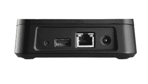

# Pogoplug 推出面向移动设备流媒体的新硬件 TechCrunch

> 原文：<https://web.archive.org/web/http://techcrunch.com/2011/09/01/pogoplug-debuts-new-hardware-for-streaming-to-mobile-devices/>

Pogoplug 系列设备和配套软件的制造商 Cloud Engines，Inc .今天推出了一款名为 [Pogoplug Mobile](https://web.archive.org/web/20230205004740/http://www.pogoplug.com/mobile/) 的新硬件产品。该设备的工作原理类似于该公司目前的 [Pogoplug 产品](https://web.archive.org/web/20230205004740/http://www.pogoplug.com/products-pogoplug.html)——你连接你的硬盘驱动器，将其插入你的路由器，立即拥有你自己的个人云。简而言之，它就像您家中的 NAS(网络附加存储)盒。

但是随着新的 [Pogoplug Mobile](https://web.archive.org/web/20230205004740/http://www.pogoplug.com/mobile/) ，该系统已经针对移动设备的使用进行了优化。首席执行官丹尼尔·普特曼说，它更像是一个“移动配件”。他说，这就是为什么你很快就会在蓝牙耳机旁边的架子上找到它，而不是藏在硬盘通道里。

Pogoplug 设备通常对 DIY、“自己主持”的人群有吸引力，他们避免使用谷歌、亚马逊、苹果或微软等大公司维护的云存储服务，或 Box.net 和 Dropbox 等小型初创公司的在线服务。Pogoplug 不需要支付存储即服务的费用(通常通过月费或年费),只需要一次性投资:硬件和软件的成本。

对于 [Pogoplug Mobile](https://web.archive.org/web/20230205004740/http://www.pogoplug.com/mobile/) ，这个价格是 79.99 美元——比原始设备的[便宜一点，仍然是 99 美元。同样适用于新推出硬件的软件产品](https://web.archive.org/web/20230205004740/http://www.pogoplug.com/products-pogoplug.html)[售价 29 美元。然而，该软件是一个可选的，如果非常实用，附加。](https://web.archive.org/web/20230205004740/http://www.pogoplug.com/products-pogoplug-premium-software.html)

Pogoplug 移动设备可以通过[移动应用](https://web.archive.org/web/20230205004740/http://www.pogoplug.com/products-pogoplug-premium-software.html)与 iOS 和 Android 配合使用，它提供了最初的 Pogoplug 所没有的新功能。例如，Pogoplug Mobile 会自动将您手机上的照片和视频备份到您的家庭网络。对于那些熟悉 [Google+为 Android 用户提供的“即时上传”功能](https://web.archive.org/web/20230205004740/http://www.google.com/+/learnmore/)的人来说，效果是相似的。除了初始配置之外，您无需付出任何努力，您的手机照片和视频不仅会为您存档，还会转换为可流式传输的小型格式，以便于手机共享。

用户可以控制同步是通过 3G 还是 Wi-Fi 进行，以及是否应该将原始媒体、转换后的文件或两者都发送回家。Android 用户也可以通过设置选择同步额外的目录。

既然有其他选择，为什么还有人想使用 Pogoplug 呢？如上所述，有些人更喜欢一次性费用，而不是经常性费用，而其他人只是喜欢自己控制自己。此外，即使在苹果即将推出的 [iCloud](https://web.archive.org/web/20230205004740/http://www.apple.com/icloud) 、[的情况下，也只有最近的 1000 张照片会存储在云](https://web.archive.org/web/20230205004740/http://www.apple.com/icloud/features/photo-stream.html)中 30 天——为了不丢失它们，你仍然需要将你的设备同步到你的 PC 或 Mac 上，以便永久保存它们。有了 Pogoplug，就有了“设置好就忘了”的吸引力。

尽管该公司希望被视为更多的移动附加产品，但它可能会面临向最终用户解释这些差异的挑战，这些用户受到苹果围绕 [iCloud](https://web.archive.org/web/20230205004740/http://www.apple.com/icloud) 的“it just works”营销的吸引。当苹果为你做所有事情的时候，为什么还要买硬件？事实上，为什么要考虑文件存储在哪里以及以什么格式存储？虽然 Pogoplug 一直有一点极客的吸引力，但随着这一产品的发布，它成为主流的愿望显而易见。能否跨越，有待观察。