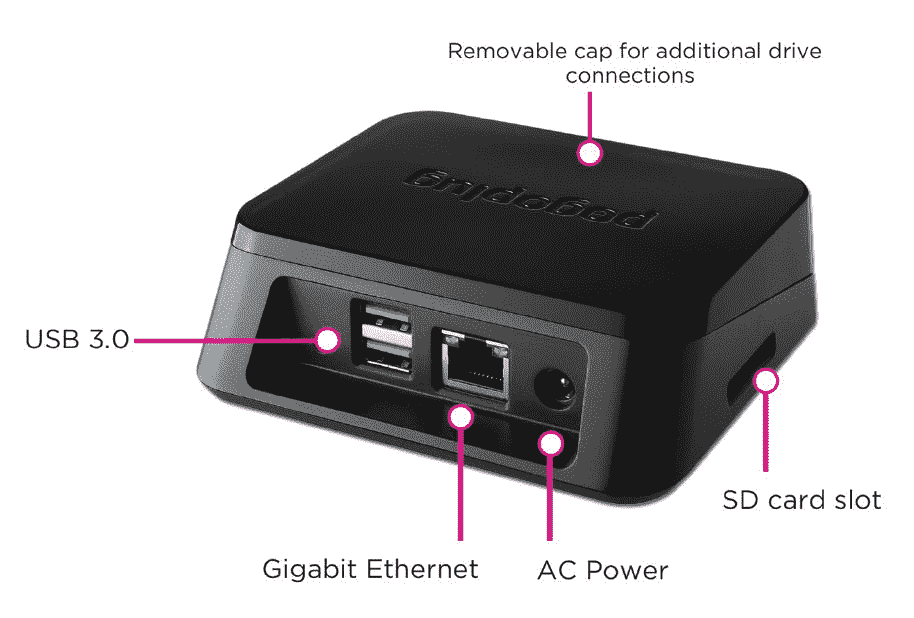

# Pogoplug 推出新硬件，为您的电脑带来无限存储空间 

> 原文：<https://web.archive.org/web/http://techcrunch.com/2011/12/14/pogoplug-launches-new-hardware-brings-unlimited-storage-to-your-pc/>

Pogoplug 正在[发布](https://web.archive.org/web/20230209124935/http://www.pogoplug.com/expansion)其第四代旗舰产品 Pogoplug Series 4。与所有 Pogoplug 硬件一样，新设备允许您连接硬盘并插入路由器，以便立即为您提供自己的个人在线存储云。

该服务还提供 5 GB 的免费在线存储空间，并针对移动用户进行了优化，如果需要，还可以购买额外的云存储空间。但是，所有拥有自己存储的 Pogoplug 设备用户都可以免费使用。

更新后的 Pogoplug 硬件的价格与之前一样:99.99 美元。它提供了四种不同类型的连接，包括 USB 3.0 (x2)、USB 2.0 (x1)、SATA/USM (x1)和 SD 卡(x1)。

【T2

该硬件旨在与 Pogoplug 的配套软件套件配合使用，这是一种免费的增值服务，允许您通过网络将存储照片、音乐和电影传输到任何 PC 或 Mac，或者传输到您的智能手机或平板电脑。高级版本(29 美元)包括向任何连接的设备传输流媒体的能力，而不仅仅是家用电脑。对于那些对购买任何硬件不感兴趣的人来说，该软件可以独立运行，将您的计算机变成基于软件的 Pogoplug 版本。

该公司还提供了一款更便宜的 Pogoplug 移动设备，价格为 79 美元，可通过移动应用程序与 iOS 和 Android 配合使用，提供移动专用功能，如自动备份移动照片和视频，对于 Android 用户来说，它为他们的平台提供了类似于苹果 iCloud 的功能。这款移动产品还可以将你的媒体转换成更适合移动观看和分享的流媒体格式。

Pogoplug 更大的问题是，它现在几乎令人眼花缭乱(是的，我要说:令人困惑)的一系列选择是，为什么有人会选择这个选项，而不是谷歌、亚马逊、微软、Dropbox、Box.net 等云存储和服务公司的选项？

虽然那些只使用软件(没有设备)的人和那些想要移动优化的内容和备份的人必须为超过 5 GB 的额外存储空间付费，但廉价的 Pogoplug 用户可以免费获得一切，除了购买硬件的一次性购买价格。即使 Pogoplug 的云[不是](https://web.archive.org/web/20230209124935/https://techcrunch.com/2011/11/14/pogoplug-cloud-launches-with-5-gb-of-free-storage-for-mobile-users/)，这也很划算。

Pogoplug 对于像我一样在家里有大约 5 个旧 USB 硬盘的人来说尤其有用，这些硬盘中的内容都是您想从任何地方访问的，但没有简单的方法让它们在线。

新 Pogoplug 在 www.pogoplug.com/expansion 的[有售。](https://web.archive.org/web/20230209124935/http://www.pogoplug.com/expansion)