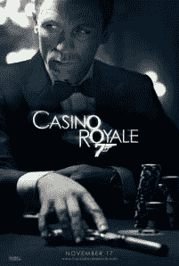

# Poker.org 卖了 100 万美元，是有史以来最高的。组织域名| TechCrunch

> 原文：<https://web.archive.org/web/https://techcrunch.com/2010/02/17/poker-org-sold-for-1-million-most-ever-for-org-domain/>

# Poker.org 卖了 100 万美元，是有史以来最高的。组织域

域名市场  [Sedo](https://web.archive.org/web/20230326192113/http://www.sedo.com/) 促成了迄今为止最大的一笔. org 域名交易。作为国家 A-1 广告公司的代理，poker.org 的域名以 100 万美元的价格卖给了 PokerCompany.com。出售 poker.org 之前，最高。engineering.org 的销售额为 19.8 万美元，其次是 sexe.org，销售额为 15.14 万美元。poker.org 的售价比一些最大的要低。Toys.com 的销售额为 510 万美元，candy.com 的销售额为 300 万美元。编辑:Sex.com 是最大的。以 1400 万美元的价格出售。Fund.com 值得注意的是，它卖了 1000 万美元。

的域名注册。根据 pir.org 的统计，2009 年上半年，这一数字比去年同期增长了 11%,目前已经超过 700 万。org 域名注册，制作。org 的第三大域名扩展，仅次于。com 和. net。