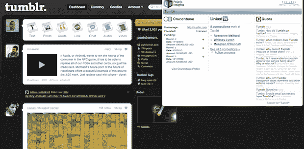

# Quora + CrunchBase + LinkedIn =有史以来最好的扩展？TechCrunch

> 原文：<https://web.archive.org/web/http://techcrunch.com/2011/01/26/polaris-insights-extension/>

# Quora + CrunchBase + LinkedIn =有史以来最好的扩展？

一个月前，北极星创投的负责人瑞安·斯普恩写了一篇简短的博客文章，寻找一名有 Chrome 扩展/应用经验的开发者。他有一个非常简单的想法来帮助他的工作。马特·巴斯塔(Matt Basta)看到了这个帖子，几乎是瞬间就创造出了斯普恩一直在寻找的延伸。现在他们开放给所有人使用，并称之为[北极星洞察力](https://web.archive.org/web/20230203020906/https://chrome.google.com/webstore/detail/golfffpdocdndgkahjdgofkbcoiefdmo)。

这个简单的应用程序非常非常流畅。你只需访问你感兴趣的公司的网站，点击扩展按钮，你就会看到该公司的 CrunchBase、LinkedIn 和 Quora 数据的叠加图。CrunchBase 栏向你展示资金信息，LinkedIn 栏向你展示你在公司内部的关系，Quora 栏向你展示一些关于公司的问答对话。

没错。太棒了。显然，主要是因为 CrunchBase 的使用。不过，好吧，另外两个也很酷。

斯普恩说:“我想博客、风投、业务开发和销售人员会发现这非常有用。确实如此。这已经是我新的最好的朋友了。

我们以前写过关于 Quora 扩展的文章，但那只是给你显示通知。这给了你实际的数据——而且是以一种有趣的方式。该扩展没有使用 Quora API(仍处于初级阶段,[),而是使用 Chrome 从 Quora.com 后台提取数据并自动完成扩展的能力。而且这些都是缓存的，所以 Basta 开玩笑说，它不会把 Quora 变成 Tumblr——也就是说，它不会削弱这项服务。](https://web.archive.org/web/20230203020906/https://techcrunch.com/2011/01/07/quora-api/)

Polaris Insights 目前只有 Chrome 版本，但 Spoon 说如果它足够受欢迎，他们会很乐意做 Firefox 版本。

