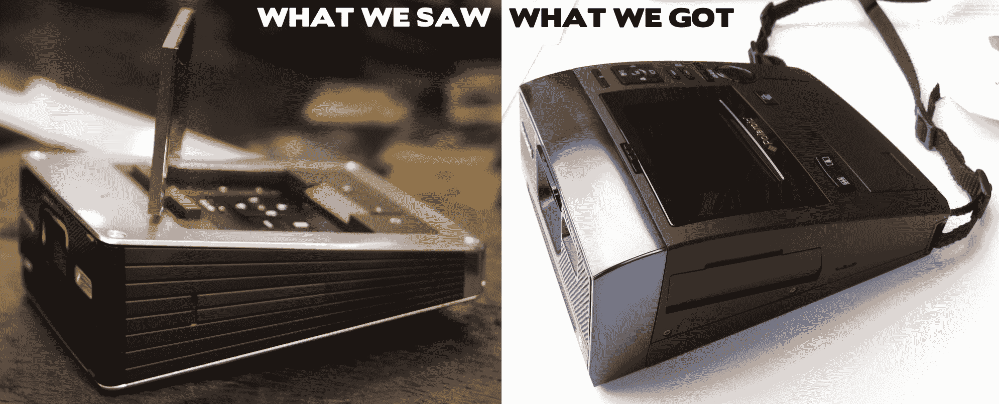

# 宝丽来的 Z340 不太像我们在 CES TechCrunch 上看到的那种 Gaga 风格的美

> 原文：<https://web.archive.org/web/https://techcrunch.com/2011/07/28/polaroids-z350-isnt-quite-the-gaga-inspired-beauty-we-saw-at-ces/>

# 宝丽来的 Z340 不太像我们在 CES 上看到的那种 Gaga 风格的美

回到 CES，我们花了很长时间等待 Lady Gaga 出现(再次)并介绍她的新产品线，这是与宝丽来合作的产品，名为 Grey Label。相机太阳镜和蓝牙打印机没有让我们大吃一惊，但 GL30 相机原型确实让我们大吃一惊。[太美了。](https://web.archive.org/web/20230203075632/http://ces.crunchgear.com/2011/01/polaroid-and-lady-gaga-introduce-grey-gl30-instant-camera/)当然，无论我给宝丽来装了多少窃听器，我都没有得到任何关于可用性或诸如此类的消息。然后*这个*东西出现了！

我不确定这是我们在 CES 上看到的同一款产品。也许是那种产品的亲戚，但不是真货。我拒绝相信他们会扔掉这样一个完美的设计，一个与 Gaga 本人有关的设计。这是什么？

ePhotozine 在这里预览的 Z340 与原型 GL30 有相似之处，但我不会挖掘它们的区别。闪亮的贴面和风箱图案不见了。液晶显示器下的控制(我猜有点不切实际)不见了。这些照片显示了一个并不特别可爱的界面，虽然我不想在没有尝试的情况下对它进行太多的抨击，但那一大堆按钮看起来并不有趣。我讨厌辛克，但这不是我想随身携带的东西。

宝丽来还没有给我回复，我们也没有被邀请参加动手派对(嗤之以鼻)，所以在我们听到真正的 GL30 的命运之前，谁也说不准这东西是怎么回事。我们只知道它的售价为 229.99 英镑(约合 375 美元)，将于 12 月上市。

**更新**:宝丽来写道“Z340 将于今年 10 月在美国和英国上市。GL30 即时数码相机将于 2012 年春季上市。”我也是这么想的:GL30 的定型时间有点太长了，而这款可能是一款更加面向消费者的原型车的抛光版，目前已经上市。