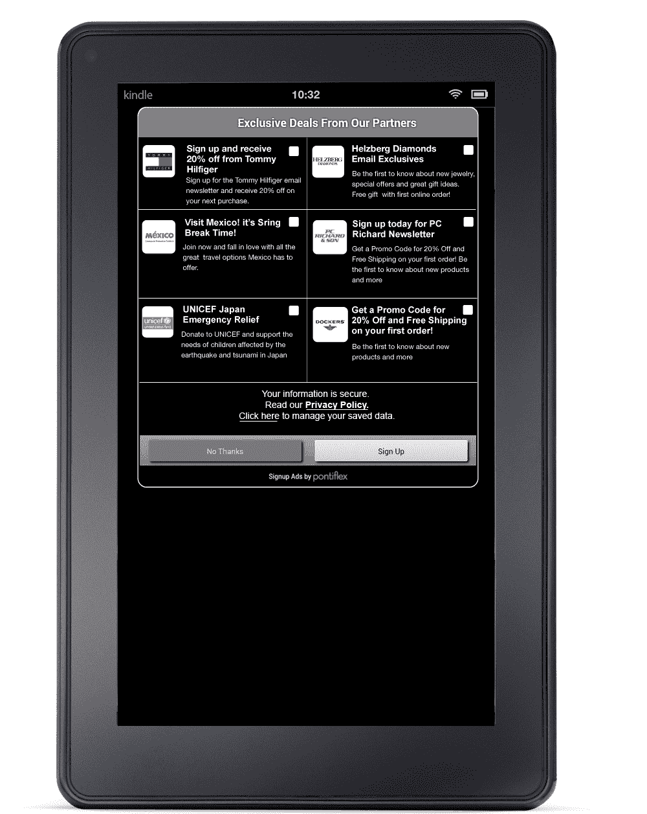

# Pontiflex 将其“注册”移动广告引入 iOS5、Android 平板电脑 TechCrunch

> 原文：<https://web.archive.org/web/http://techcrunch.com/2011/11/01/pontiflex-brings-its-signup-mobile-ads-to-ios5-android-tablets/>

# Pontiflex 将其“注册”移动广告引入 iOS5 和 Android 平板电脑

移动广告 [Pontiflex](https://web.archive.org/web/20230203164709/http://www.pontiflex.com/) 今天发布了其 [AppLeads](https://web.archive.org/web/20230203164709/http://www.pontiflex.com/appleads/) Smart SDK 的更新，该更新将其在线“注册”平台引入 iOS5 设备和 Android 平板电脑，包括 Kindle Fire。此前，该系统适用于旧版本的 iOS 和 Android 智能手机。

这些注册广告是一种不同类型的移动广告——其目标不是点击，而是让客户选择加入以听到更多来自相关广告客户的信息。

注册广告让客户无需离开应用程序就能与广告互动。目前，这意味着输入邮政编码和电子邮件地址，尽管 Pontiflex 正在开发一个将社交元素引入广告的产品版本。例如，消费者可以“喜欢”脸书上的广告客户，甚至与他们的朋友分享广告。*(别笑——有些人真的会分享广告。见鬼，有些人甚至在博客上写他们喜欢的广告。当广告客户推销大量交易、优惠券、折扣或销售时，社交分享的可能性增加，当然，他们可能会这样做。*

Pontiflex 表示，现在在 iOS 上运行其广告的应用程序不到 1000 个，每月注册人数为 400 万。一些大牌广告商正在参与该平台，包括 1-800 Flowers、西南航空、萨克斯、巴尼百货、金佰利(Huggies)等。当消费者与广告互动时，考虑了 27 种不同类型信号的算法从互动中学习，并猜测消费者最有兴趣看到哪些广告。

Pontiflex 得到了新大西洋风险投资公司、翠贝卡风险投资公司和 RRE 风险投资公司的支持。迄今为止，它已经筹集了 1400 万美元的资金。要观看 AppLeads 的演示，请点击[这里](https://web.archive.org/web/20230203164709/http://www.pontiflex.com/appleads/demo.jsf)。

