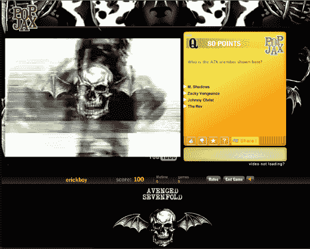

# Popjax 推出品牌视频琐事游戏，重金属摇滚七倍复仇

> 原文：<https://web.archive.org/web/https://techcrunch.com/2008/05/20/popjax-launches-branded-video-trivia-games-with-heavy-metal-rockers-avenged-sevenfold/>

# Popjax 推出品牌视频琐事游戏，重金属摇滚乐手复仇七倍

在网上最流行的两件事是玩游戏和看视频。由 Shasta Ventures 和 Draper Fisher Jurvetson 支持的初创公司 Popjax 将 to 结合起来，创造了一种新形式的休闲游戏:视频琐事。该公司利用 YouTube 上的嵌入式视频创建了自己的琐事问题混搭。

现在，它正在追逐摇滚乐队，为他们的粉丝创造品牌视频游戏。第一个创作游戏的乐队被复仇者七倍。如果你是重金属迷(我知道你是)，你可以在这里玩游戏。该乐队还将在其粉丝网站[和](https://web.archive.org/web/20230319233910/http://www.avengedsevenfold.com/) [MySpace 页面](https://web.archive.org/web/20230319233910/http://www.myspace.com/avengedsevenfold)上嵌入这款游戏(该网站拥有 719，000 名好友)。它让粉丝在他们的网站上停留更长时间，Popjax 与乐队分享应用程序的广告收入和附属销售费用。

现在为我真正听的乐队制作一个小游戏怎么样？(我知道，我老了)。