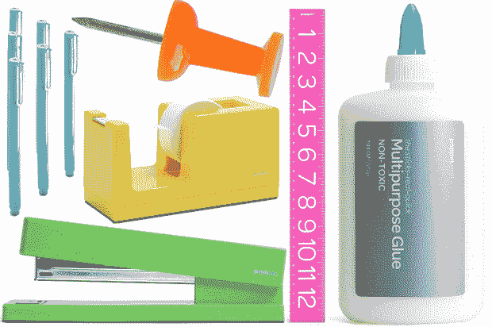
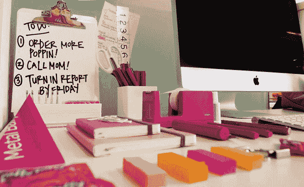

# Poppin 从 Shasta 和首轮融资中获得 600 万美元，用于美化你乏味的办公室| TechCrunch

> 原文：<https://web.archive.org/web/https://techcrunch.com/2012/02/27/poppin-shasta-first-round/>

# Poppin 从 Shasta 和首轮融资中获得 600 万美元，用于美化你平淡无奇的办公室

污浊的办公室会挫伤士气，让每项任务都变得乏味。但是 [Poppin](https://web.archive.org/web/20230327220337/http://www.poppin.com/) 知道一个快乐的员工是一个高效的员工，并希望通过其充满彩色办公用品的在线商店来保持你的这种状态。随着持续的人才危机使留住员工变得比以往任何时候都更加重要，Shasta Ventures 在 Poppin 中看到了光明的未来，因此它在 Poppin 领导了一轮新的 600 万美元的 A 轮投资。首轮资本(First Round Capital)和几个天使投资者的加入，将使 Poppin 有兴趣扩展到家具和其他必需品，并在预计 3000 亿美元的办公产品市场上喷洒彩虹。

Poppin 的目标是让“购买、使用、查看和思考办公产品成为一种非凡的体验。”这看起来很荒谬，但这个网站实际上很不错。按颜色、类别或捆绑包浏览产品，并使用特殊的重新排序工具立即发送另一组您的最爱。

联合创始人克里斯·伯奇了解时尚。他是 Jawbone PowerMat 和 Voss Water 的投资者。正如你所看到的这些由酷猎汇集的[图片，Poppin 的产品绝对值得 Pinterest 关注。](https://web.archive.org/web/20230327220337/http://www.coolhunting.com/design/poppin.php)

我们令人敬畏的办公室管理员格雷格说:“价格似乎真的很合理，特别是与 Office Depot 相比，但没有太多的选择。”如果顾客只能购买他们供应品的一部分，就很难吸引顾客。Poppin 应该将部分资金用于与它错过的畅销书的时尚制作人达成协议。

活页夹和便利贴的利润率可能很低，但 Poppin 将很快开始销售高价家具，这可能会提高利润率。如果它能找到既美观又符合人体工程学的桌子、椅子和沙发，它就能吸引像谷歌和脸书这样不介意花钱取悦和保护员工的顶级雇主。

