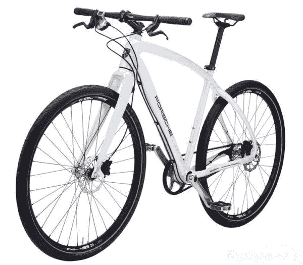
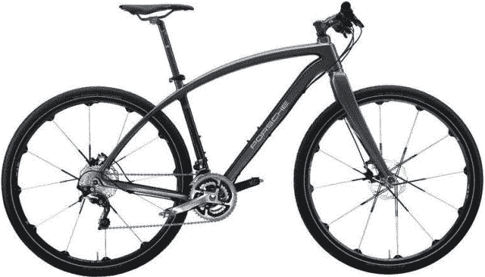

# 保时捷 Sport 和 Rennsport 自行车，专为爱车人士打造 TechCrunch

> 原文：<https://web.archive.org/web/http://techcrunch.com/2011/07/22/porsches-sport-and-rennsport-bikes-for-the-car-loving-cyclist/>

# 保时捷运动和休闲自行车，专为爱车人士打造

去年我们已经看到了奥迪和 T2 的自行车，所以我认为看到保时捷和 T4 的竞争并不奇怪。这家德国跑车巨头实际上已经有一辆自行车很长时间了，但我相信 new Sport 和 Rennsport 是他们首次尝试公路自行车，而不是山地自行车。

这些“车手精选”自行车是精致和性感的类型，更多地模仿奥迪的木框架模型，而不是迈凯轮的高度调整的赛车。铝运动或 S 有一个 11 齿轮皮带传动，重 12 公斤(约 26 磅)，这是轻，但…没有那么轻。Rennsport (RS)的重量轻得多，只有 9 公斤，这无疑是由于它的碳纤维车架和前叉。它有一个 20 档禧玛诺(Shimano)变速器，配有传统链条，并配有夹式踏板。两者都有 Magura 陶瓷盘式制动器。

不错的自行车，但让我们直说吧。这些东西有什么损坏？这项运动售价高达 3300€(约 4750 美元)，将于 9 月上市。Rennsport…嗯。有备用的€5900 吗？那是你微不足道的美元中的 8500 美元。什么，你认为保时捷会走低端市场？

不过，我告诉你，如果有人在我口袋里放一万美元，拿枪指着我的头，让我买一辆这样的豪华自行车，我可能会买那辆迈凯轮。我太害怕在城市里骑它，但我想我更喜欢它而不是这些身份象征，尽管我毫不怀疑它们也是很好的骑行。

【via [出身豪门](https://web.archive.org/web/20230203102639/http://www.bornrich.com/entry/porsche-sports-rennsports-bikes-combine-style-comfort-safety/)