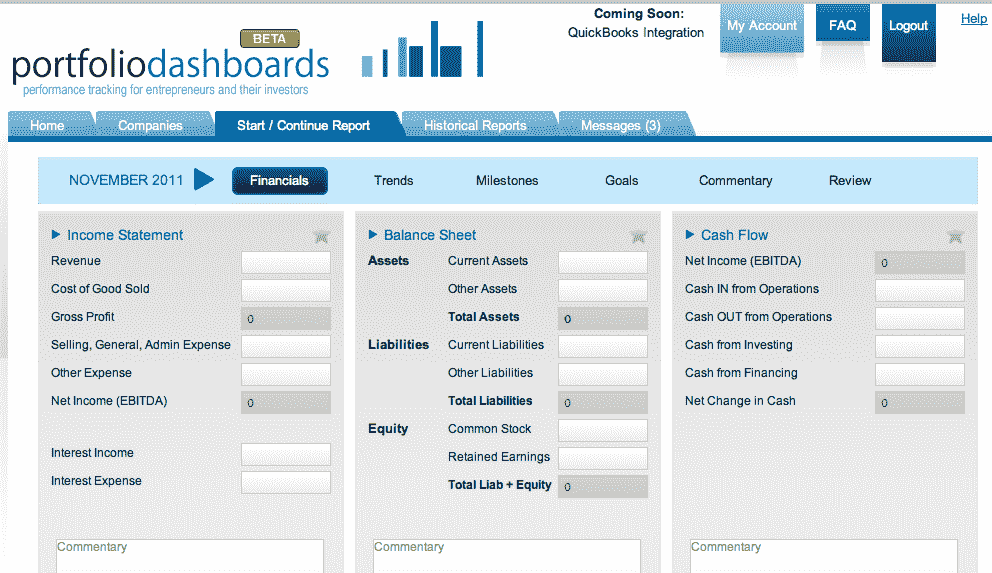

# PortfolioDashboards.com 旨在帮助天使投资人、风险投资人追踪投资 

> 原文：<https://web.archive.org/web/http://techcrunch.com/2011/11/15/portfoliodashboards-aims-to-help-angels-vcs-track-investments/>

# PortfolioDashboards.com 旨在帮助天使、风投跟踪投资

今天，PortfolioDashboards.com 的公测版发布，该网站旨在帮助天使投资者和风险投资公司密切监控他们投资组合的表现。

你可以在这里注册[服务。](https://web.archive.org/web/20230204164109/https://portfoliodashboards.com/signup)

最初成立于 2008 年，PortfolioDashboards.com 提供了一个专门为初创公司设计的免费绩效跟踪工具。该服务通过一个[可定制的仪表板](https://web.archive.org/web/20230204164109/https://portfoliodashboards.com/how-it-works)向投资者和其他利益相关者提供标准化的报告。

对于企业家来说，该网站旨在简化报告流程，提供提醒和简单易用的报告创建向导。可以提交的数据包括财务报告、里程碑、公司目标信息、评论等。

PortfolioDashboards.com 对投资者免费，并为零投资者或极少投资者的初创公司提供免费订阅服务。对于有多个投资者、董事会成员和其他利益相关者的初创公司，有一个月订阅服务，计划从每月[39 美元](https://web.archive.org/web/20230204164109/https://portfoliodashboards.com/pricing)开始。

如果这项服务对企业家和投资者有吸引力，如果他们愿意为这样的解决方案付费，我很想听听他们的意见。

