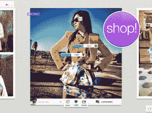

# 拥有 100 万用户的 Pose 将其时尚照片应用程序带到了 iPad 上，并开始创造(和分享)收入 

> 原文：<https://web.archive.org/web/https://techcrunch.com/2012/09/06/pose-ipad-commerce-revenue-sharing/>

# 拥有 100 万用户的 Pose 将它的时尚照片应用程序带到了 iPad 上，并开始创造(和分享)收入

自从 2011 年初在[推出 iPhone 应用](https://web.archive.org/web/20221005231028/https://beta.techcrunch.com/2011/01/11/pose-a-photo-sharing-app-for-fashion-and-shopping-that-just-raised-1-6-million/)以来，Pose 已经取得了一些重大进展。它的移动照片分享平台[，让人们分享他们服装的快照](https://web.archive.org/web/20221005231028/http://www.crunchbase.com/company/pose-com)，并在上面贴上品牌和设计师的详细信息，现在已经有 100 万用户在这个应用上分享了超过 200 万个“姿势”。现在，每天有超过 10，000 个姿势被来自世界各地的用户添加到这个平台上，从俄罗斯到巴西到美国以及更远的地方——首席执行官达斯汀·罗森喜欢把它比作“比《Vogue》杂志一年生产的时尚内容还要多”

现在，这家总部位于洛杉矶的初创公司将推出新功能，这很可能使其平台更受欢迎——因为新用户增长和当前用户粘性。

今天，Pose 将发布其第一款专为 iPad 制作的本地应用[。除了 iPad 应用程序，Pose 还推出了有史以来第一个创收组件，该组件将在其所有平台上活跃:“可购物内容”，将 Pose 照片中标记的物品直接链接到销售它们的电子商务网站，让用户无需离开 Pose 应用程序即可完成购买。Pose 将通过在其平台上发起的每笔销售收取代销费。](https://web.archive.org/web/20221005231028/http://itunes.apple.com/us/app/pose-discover-fashion-beauty/id402272154?mt=8)

为有购物内容的 iPad 摆姿势

#### 与用户分享战利品

这些可能看起来像是 Pose 的标准动作——但真正的转折是该公司将如何部署它将开始赚钱的现金。Pose 将从每件商品售出时收取的代销商费用中抽取“一小部分”，但会将绝大部分资金交给最初在照片中分享该商品的用户。这笔钱将通过贝宝存入；Pose 还将向每个用户展示他们在 Pose 上标记和分享的物品的详细购买活动分析。

罗森在最近的一次采访中告诉我，“我们决定让我们的博主从每次购买中获得大部分佣金，因为我们认为让他们真正拥有自己的内容和链接非常重要。”。“我们只是想进一步激励他们分享最好的内容。他们一直在要求这项(电子商务)功能，我们真的想把它做好。”

#### 对用户生成内容的不同看法

这是一个非常独特的举动。大多数建立在用户生成内容上的网站——也就是几乎所有的社交媒体——不会与实际创建这些内容的用户分享他们围绕这些内容所赚的钱。起初，一家初创公司放弃其第一个创收功能带来的大部分现金似乎很疯狂，但这表明 Pose 确实在考虑长期问题。很难想象还有什么比每月收到一张支票更让用户开心的事了——给他们最时髦的衣服拍照。看看这会如何影响 Pose 未来的发展轨迹将会非常有趣；这似乎可以给该应用带来用户增长和参与度的大幅提升。

#### 更多的钱会随之而来

Pose 已经从投资者那里筹集了约 460 万美元的风险投资，投资者包括 GRP Partners、True Ventures、Mousse Partners 以及明星时装设计师和造型师瑞秋·佐伊。该公司表示，这些投资者现在对其收入分成策略感到满意，因为他们看到了 Pose 未来赚更多钱的潜力。

“我们当然相信我们公司的宏伟愿景，即内容与商业相结合。“我们认为自己就像一个购物漏斗，在这个漏斗中，沿着这条线的不同点有很多赚钱的机会，”Pose 的联合创始人兼创意和合作副总裁亚里沙·古尔德-西蒙告诉我。“优秀的内容始于我们的用户，我们只想成为一个促进这一点的平台。首先，也是最重要的，这是关于建立一个观众群。”