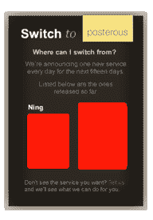
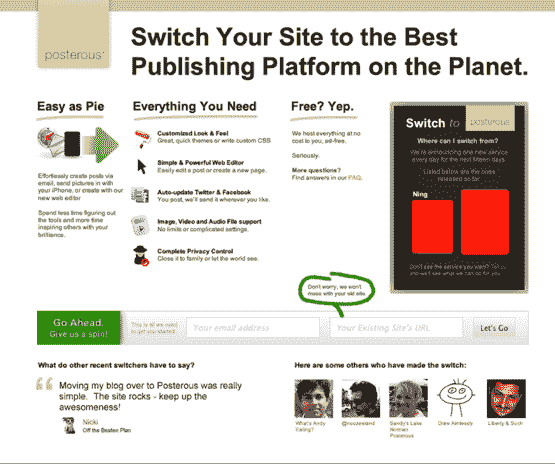

# Posterous 目标宁在大规模转换运动。下一个是谁？TechCrunch

> 原文：<https://web.archive.org/web/https://techcrunch.com/2010/06/22/posterous-targets-ning-in-massive-switching-campaign-who-is-next/>

# Posterous 目标宁在大规模转换运动。下一个是谁？

我们是简单易用的博客平台 [Posterous、](https://web.archive.org/web/20230108183930/http://posterous.com/)的忠实粉丝，该平台自 2008 年[推出](https://web.archive.org/web/20230108183930/https://techcrunch.com/2008/06/28/posterous-beats-tumblr-in-simplicity/)以来，增长迅速、[收入](https://web.archive.org/web/20230108183930/https://techcrunch.com/2010/01/18/posterous-revenue-coca-cola/)和[可观的资金](https://web.archive.org/web/20230108183930/https://techcrunch.com/2010/03/05/redpoint-invests-4-4-million-in-fast-growing-posterous/)。在过去的六个月里，Posterous 稳步地为其发布平台增加了近十几个创新功能，包括[静态页面](https://web.archive.org/web/20230108183930/https://techcrunch.com/2010/06/04/posterous-adds-pages-enables-about-me-section-youve-always-wanted/)支持、[评论审核](https://web.archive.org/web/20230108183930/http://blog.posterous.com/launching-comment-moderation-control-what-com)、[自定义域名](https://web.archive.org/web/20230108183930/http://blog.posterous.com/posterous-makes-it-dead-simple-to-register-a)，以及一个用于 Twitter 的[媒体共享服务](https://web.archive.org/web/20230108183930/https://techcrunch.com/2010/01/21/posterous-postly-twitter/)。众所周知，Posterous 希望成为消费者日常简单的发布平台。今天，在寻求世界统治地位的过程中，这家初创公司推出了一项大规模转换计划，帮助用户将所有内容从其他发布和博客网站转移到 Posterous。

在接下来的 15 天里，Posterous 将每天宣布一项不同的服务，允许你免费将你的账户、博客、视频、图片等转移到这个简单的博客网站上。首先出场的是宁。要切换，你只需给 Posterous 你想移动的博客的网址和你的电子邮件地址，Posterous 就会在他们复制完一个网站后给你发一封电子邮件。你也不需要预先拥有 Posterous 的帐户来进行转换。

联合创始人 Sachin Agarwal 说，转换时间将根据被转换网站的大小而变化。10 个帖子只需要几分钟，但 1000 个帖子和大量视频和图像(Posterous 将托管)需要更长时间。最棒的是，所有这些工作都是免费的。如果你不相信 Posterous 的声明，这里有一个[的推荐页面](https://web.archive.org/web/20230108183930/http://switchto.posterous.com/)，上面是使用过导入工具的 beta 用户。

至于 Posterous 现在将提供切换的平台，考虑到许多免费使用网络的宁用户可能会在宁[关闭其免费服务](https://web.archive.org/web/20230108183930/https://techcrunch.com/2010/04/15/nings-bubble-bursts-no-more-free-networks-cuts-40-of-staff/)后寻求切换，宁是有道理的。Posterous 是一个不错的选择，它具有增强的定制特性。

那么，转换计划中的下一项服务是什么呢？Agarwal 和营销副总裁 Rich Pearson 不会告诉我，但我认为可以肯定 Posterous 会瞄准一些平台。虽然 Posterous 去年为 WordPress 推出了一个“快速而肮脏”的转换器，Agarwal 说它相当简单。可以肯定的是，这家初创公司将在未来两周内推出更全面的迁移工具。同样可以肯定的是，TwitPic、谷歌的博客、TypePad 和 Tumblr 也包括在这个阵容中。

对于 Posterous 来说，这无疑是一场令人印象深刻的战役。Agarwal 和 Pearson 说这个团队已经为此工作了几个月。显然，Posterous 有成为事实上的发布平台的野心，现在让用户更容易转换。虽然该公司没有透露它拥有多少博客，但皮尔逊表示，该网站的用户群每月增长 20%至 25%。一点积极的营销可以大大加快增长速度。

