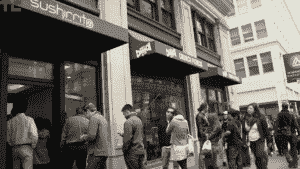
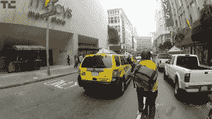
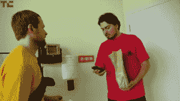
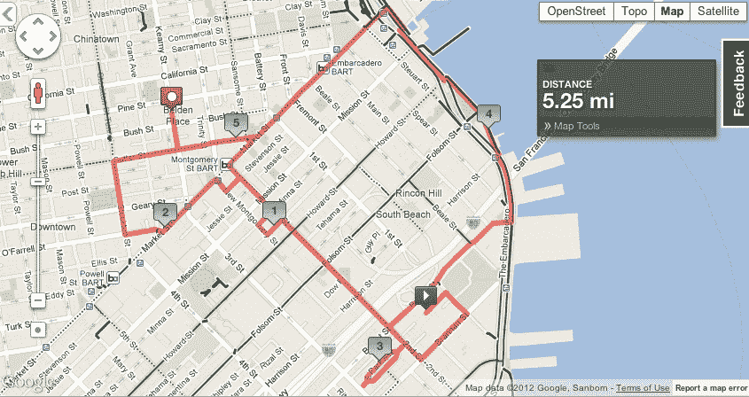

# 我当了一天邮局快递员 

> 原文：<https://web.archive.org/web/https://techcrunch.com/2012/07/02/postmates-courier-for-a-day/>

自从一个多月前[推出](https://web.archive.org/web/20221209235838/https://beta.techcrunch.com/2012/05/17/postmates-debuts-get-it-now-on-demand-courier-service-to-the-public/)以来，我一直是[post mates Get Now](https://web.archive.org/web/20221209235838/http://www.postmates.com/getitnow)送货服务的忠实粉丝，每当我感觉特别懒的时候，当我想吃一些步行不到的食物的时候，或者当我在会议间隙时间有限的时候，我都会用它来订购午餐。我非常喜欢邮局的快递员，他们给我带来我自己不会出去买的东西。所以，当他们问我是否想花一个下午的时间做一名快递员时，我当然欣然接受了这个机会。

这就是为什么在一个周五，我花了大约 3.5 个小时骑自行车，主要是挑选午餐订单，并为旧金山市中心的各种初创公司和精通技术的客户送货。

那是什么感觉？让我告诉你。

让我们从设置开始:PostMates 送货人员自带自行车和设备，但配备了一部运行 PostMates 应用程序的 iPhone，该应用程序会提醒他们有新的工作，并告诉他们在哪里取货和卸货。这家初创公司还为他们的快递员提供预付费信用卡，这样他们就可以在镇上的各个商店购物。快递员得到一点指导，然后去做一些练习，只是为了熟悉这个系统，然后他们就离开了！

所以一旦你独立了，你就接受一份工作，然后出发！我的第一份工作是在新蒙哥马利的 [Sushiritto](https://web.archive.org/web/20221209235838/http://www.sushirrito.com/) 店买几个“寿司墨西哥卷饼”,然后把它们送到卡尼和萨特街一个叫克洛伊的顾客那里。好的。

苏希里托的那条线。我花了很多时间排队。

现在通常，邮局主管收到订单后，会在快递员运送途中给餐馆打电话，这样他(或她)就可以直接走过去付款。但是在我离开后不久，我收到了邮局热线的一条短信，通知我他们无法通过电话联系到 Sushiritto 所以我只能像正常人一样排队等候。这很好，直到，嗯，我到了商店，看到了线。

大概花了 30 分钟打通线路，收到订单，之后我有大概 17 分钟的时间到达第一个配送站，只要几分钟的路程，没问题。克洛伊告诉我，这是她第一次从邮局订购，这太棒了，因为这是我第一次为他们送货。双赢！

就在我完成那项工作后，另一份快递来了，我接受了——从市中心的 Super Duper 买了一个汉堡和薯条。我再次收到一条短信，提醒我必须排队等候，因为那个地方在午餐时间也不接电话。所以我准备好了另一个漫长的等待。我没想到的是在去超级骗子的路上被淘汰了。

就在我倒下之前。看到那些从两辆出租车中间偷窥的家伙了吗？我没有。

邮局的帮助热线，在没有马上收到我的回复后，在我在路上的时候打来了电话。所以我拿起了。骑车的时候。当然，这不是最明智的举动。

所以我就在那里，骑着车去斯托克顿，刚挂上电话，几个人从两辆车中间走出来，就在我面前。我尽可能快地停下来，但这基本上意味着从我的固定装置上摔下来，滚到街上。

自我提醒:骑车穿过车流时不要打电话。

我掸掉身上的灰尘，翻过身去找 Super Duper，在那里又排了一个长长的队。根据我有限的经验，投递邮件意味着你花在排队上的时间比做其他任何事情都多。一旦我得到了食物——一个带薯条和三种自制蛋黄酱的芝士汉堡——我就去了第三和南方公园。

在 Super Duper 排队意味着我送食物有点晚了。打完一个电话后，我被带到了三楼，在那里我遇到了那个在门口等着的家伙，他不停地道歉，然后——嘿，等等……我一直在这栋楼里。我曾经在那里参加过一次面试，当时我正在申请 Wired.com 的一份工作。所以，是的，我在镜头前给一家竞争对手出版社的员工送食物。有趣有趣。

是的，我在给 Wired 的人送午餐。

我正准备收工的时候，又收到了一份工作——这次是一个我认识的名字。我的一个朋友，知道我在镇上跑来跑去做邮局的事情，她亲自下订单让我从轮渡大楼里拿巧克力并把它们送到她的办公室。我该怎么办？说不？

所以我在 Embarcadero 订了票，找到了她要送我去的高级巧克力店。在对我得到的东西有些困惑之后——她已经直接从商店预付并预订了一些东西——我打包并完成了最后一次送货，到了卡尼和派恩附近的一个办公室。在她的新办公室逛了几分钟并聊了几分钟后，我决定注销，不再接任何工作。

你可以在下面看到我的大致路线……总之，我在旧金山骑了大约 5 英里的自行车，在不到三个小时的时间里送了三次货。前两次送货我本可以得到大约 8 美元的小费——我的朋友没有给小费！——但说实话，我不确定我会为交货本身做些什么。Postmates 最近改变了定价政策，根据工作的难度向用户收费，并拒绝透露为这些工作支付给快递员的费用。

老实说，对于在城里骑三个小时的自行车来说，8 美元的小费并不算多。但是有人指出，我上一次送货时被骗了……邮局总部告诉我，快递员通常会同时做多份工作，这增加了他们收到的数量。我只是运气不好，在其中两个地方我不得不排了很长时间的队，否则我的小费会更高。

无论如何，所有这些都是说，虽然它很有趣，我喜欢我作为一名邮政局长的一天，但我可能不会放弃我的日常工作，成为一名快递员。不过，我确实对这些人更加尊重，以后我从他们那里点东西时，一定会给很多小费。(你也应该。)

*顺便说一句，我想对 TechCrunch 的电视制片人约翰·穆里略大喊一声，他拍摄并编辑了这段视频，不知何故在跟在我后面时没有撞车(他正在修理一个没有刹车的东西！).我还要感谢 Postmates 的 Ashley 和 Bastian 给了我这个机会，Jeff 给了我这个机会，还有 GoPro 的工作人员，他们给了我们一个摄像机，很多镜头都是用这个摄像机拍摄的。谢谢大家！*

