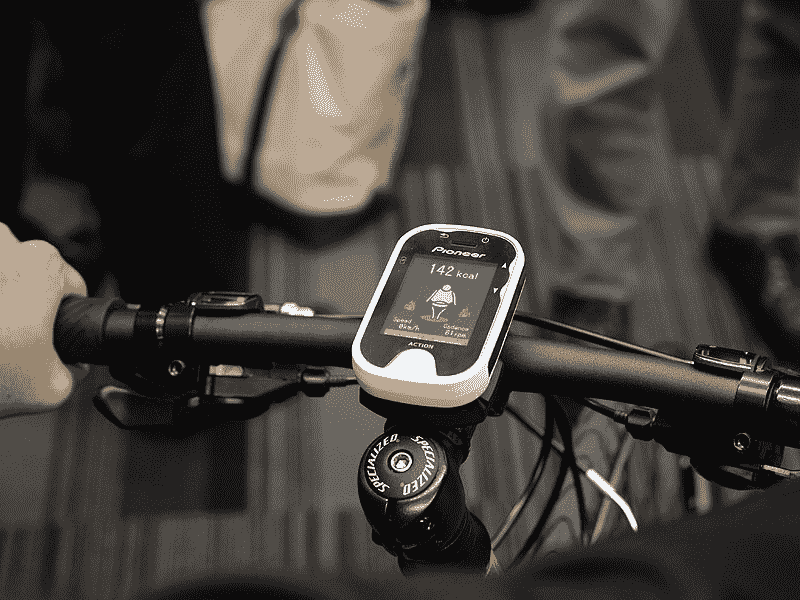
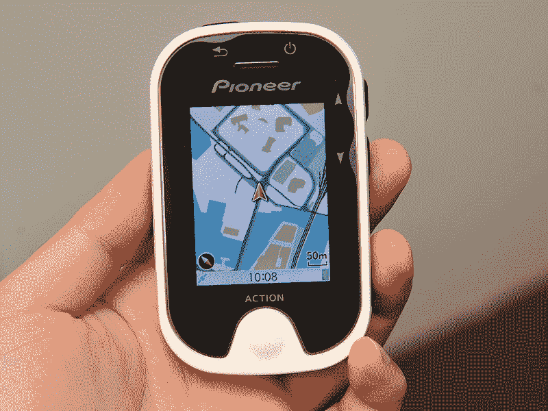

# Potternavi:先锋宣布为自行车配备 3G GPS TechCrunch

> 原文：<https://web.archive.org/web/http://techcrunch.com/2011/10/26/potternavi-pioneer-announces-3g-equipped-gps-for-bikes/>

# Potternavi:先锋宣布为自行车配备 3G 全球定位系统

先锋昨天宣布了所谓的[Potter Navi](https://web.archive.org/web/20230205003716/http://pioneer.jp/press/2011/1025-1.html)【JP】，这是一款用于自行车的 GPS，将有白色和黑色可选。买家可以期待一个 240×320 分辨率的 2.4 英寸彩色液晶显示器， [ANT+](https://web.archive.org/web/20230205003716/http://en.wikipedia.org/wiki/ANT%2B) 支持，加速度传感器，USB 端口，10 小时的电池寿命。

先锋公司表示，Potternavi 不仅可以显示地图和方向，还可以让用户寻找热门景点，例如最近的餐馆或商店。它也给出了健康骑自行车的提示，指出哪些行动燃烧了多少卡路里等。

 

有趣的是，它支持日本最大的移动运营商 NTT Docomo 提供的 3G 服务(前两年免费)。

先锋公司计划明年 2 月开始在日本销售 Potternavi(售价:527 美元)。《日经新闻》报道称，这款 100g 的设备也将于“明年夏天”登陆美国和欧洲市场。

Via [AV 手表](https://web.archive.org/web/20230205003716/http://av.watch.impress.co.jp/docs/news/20111025_486216.html) [JP]