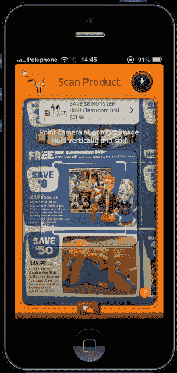
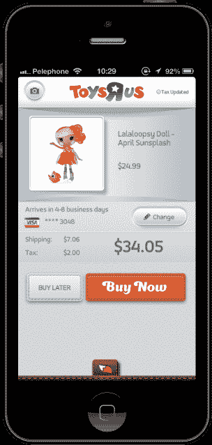

# 帮助购物者使用图像识别找到商品的应用程序“猛扑”,现在也是一个交易浏览器

> 原文：<https://web.archive.org/web/http://techcrunch.com/2013/11/12/pounce-the-app-that-helps-shoppers-find-items-using-image-recognition-is-now-a-deals-browser-too/>

最近推出的移动购物应用程序允许消费者对广告、平面广告和目录中的商品拍照，以便直接从智能手机上购买，今天推出了新版本，改善了整体体验，并帮助你找到和比较交易。

这家总部位于特拉维夫的初创公司一直在解决移动商务中最棘手的问题之一:结账。虽然许多公司，从 Pinterest 到 Wanelo 和其他许多公司，已经突飞猛进地改进了产品发现，但当谈到实际购买你喜欢的商品时，用户通常会被重定向到零售商的网站，该网站可能会也可能不会针对移动设备进行优化。然后，他们对结账过程感到沮丧，常常干脆放弃。

 来犯，不过，已经被设计成只需轻点几下就能让手机购物运转起来。

它将产品展示在消费者面前的方式也很有趣。当这款应用首次推出时，它提供了图像识别功能，让你只需拍下某种印刷材料中广告商品的照片——无需扫描条形码或二维码。

相反，该公司与零售商合作伙伴和第三方合作，建立其产品数据库，将商品照片与库存和价格信息联系起来。正如首席执行官 Avital Yachin 解释的那样，“实际上，在 20 到 30 秒内……你可以使用我们的应用程序扫描商品，应用程序将自动识别商品，我们允许你只需点击一两次就可以购买商品。”

“最重要的是，你不必一遍又一遍地输入你的账单信息和运输信息，”他说。"这是主要零售商的两次点击结账."

需要说明的是，购物者不是从来福士购买，而是通过应用程序直接从零售商那里购买，价格与他们直接从零售商网站购买的价格相同。通过简化的结账选项，零售商有机会与亚马逊的专利一键式结账竞争。

目前，来犯支持的零售商有梅西百货、Ace Hardware、塔吉特百货、玩具反斗城、婴儿反斗城、史泰博等等。Yachin 说，来扑计划在假期前支持其他几家零售商，包括百思买。

 在今天发布的新版移动应用程序中，该公司增加了几个新功能，与传统电子商务相比，这种移动购物体验功能更加完善。例如，你现在可以为时装和服饰选择不同的颜色和尺寸，还可以放大图像以便更仔细地观察。很快，猛扑将支持在结账时使用礼品卡和折扣/优惠券代码，以及在线购买和商店提货的选项。

然而，新应用更大的特点是增加了一个交易浏览器，可以让你比较所有零售商正在进行的促销活动。(虽然在应用程序能够识别印刷传单、每周通知等图片之前，它实际上并没有显示当前的促销活动包括哪些内容。)这种拉起最新折扣的能力使猛扑与其他购物交易发现者竞争，如 Shopular、RetailMeNot、Shopkick、Zoomingo 等。但这些应用程序也不提供简化的结账或图像识别功能，这是让来犯者脱颖而出的原因。

该公司由五名全职团队组成，由当地天使投资者提供未披露的种子轮融资支持，目前正在筹集首轮融资。

iOS 版的新版本可以在下载[。](https://web.archive.org/web/20230320010224/https://itunes.apple.com/app/pounce-1-tap-ordering/id583704265?mt=8)