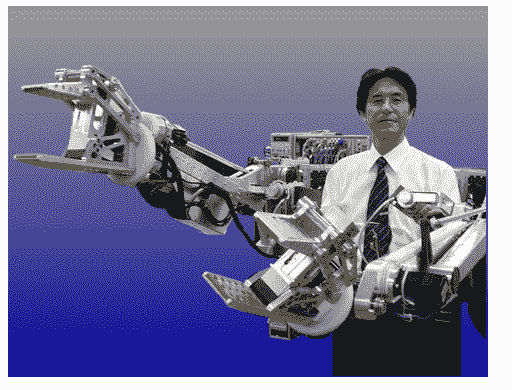
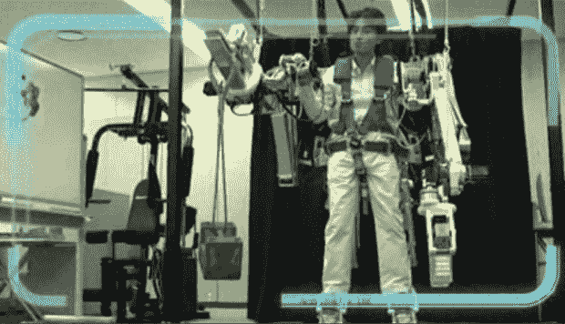
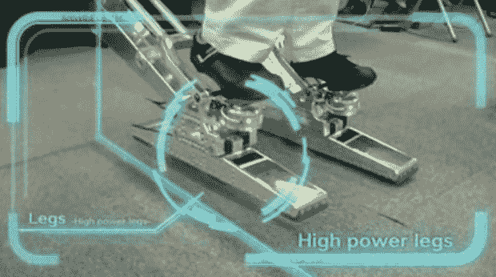

# 电动装载机:松下风险投资公司接受机甲机器人套装订单

> 原文：<https://web.archive.org/web/https://techcrunch.com/2010/01/28/power-loader-panasonic-venture-accepts-orders-for-mecha-robot-suits-video/>

# 动力装载机:松下风险投资公司接受机甲机器人套装订单(视频)

 
步行车辆，也被称为[机甲](https://web.archive.org/web/20230322155911/http://en.wikipedia.org/wiki/Mecha)，在今天的机器人行业中并没有发挥太大的作用，但这可能很快就会改变。(你可能还记得《阿凡达》中的一个主角，在最后的战斗中，坐在一架机甲里，电影里叫 AMP。)现在，总部位于东京的机器人公司 Activelink(一家松下的衍生公司)表示，它也可以为你制造一个机器人。

这家初创公司已经开始接受他们名副其实的 Power Loader 的订单，这是一种功率放大的机器人服装，可以让人类携带高达 100 公斤的负载。用户需要将脚绑在机器人的腿上，握住手柄来控制两个多用途臂。然后，他们能够举起高达 2 米的重物并四处搬运。

松下的外骨骼重 230 公斤，高 1.6 米。显然，这里的主要目标是建筑企业，但电动装载机也可以在自然灾害后派上用场。

Activelink 表示，他们一直在努力使这种机甲更容易使用和行走，他们现在准备生产定制的单位。不过有一个缺点:第一个实用版本在 2015 年之前不会准备好(不幸的是)。

这是官方的电动装载机宣传视频。我敢打赌，这只是一个巧合，它使用的音乐听起来就像 http://blip.tv/play/hMQ5gcGGBQI%2Em4v 的[亚基拉](https://web.archive.org/web/20230322155911/http://www.imdb.com/title/tt0094625/)配乐:

Via [日经](https://web.archive.org/web/20230322155911/http://www.nni.nikkei.co.jp/e/ac/tnks/Nni20100127D27JFA20.htm)【需要注册，付费订阅】