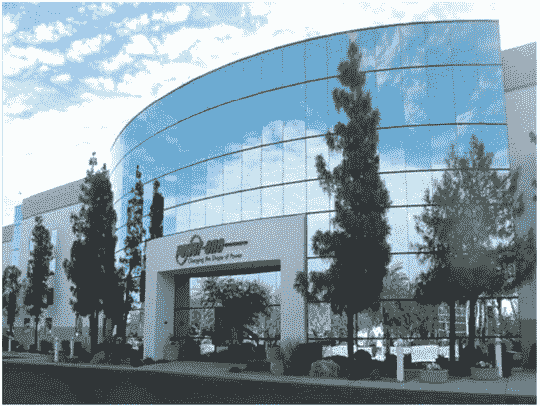

# Power-One 在美国开设首家制造逆变器的工厂，将可再生能源转化为电网电力 TechCrunch

> 原文：<https://web.archive.org/web/http://techcrunch.com/2011/01/31/power-one-phoenix-factory/>

# Power-One 在美国开设第一家制造逆变器的工厂，将可再生能源转化为电网电力

Power-One，Inc .(NASDAQ:PWER)——一家为可再生能源行业提供电力逆变器的大型制造商以及管理电力采集和分配的软件提供商——今天在凤凰城开设了其第一家北美制造工厂，他们计划在那里雇用 350 名全职员工。

根据该公司的新闻声明，该工厂将主要生产光伏和风能逆变器，将可再生能源转化为可用的电力形式，用于公共电网的配电。周一，动力一号的首席执行官 Richard J. Thompson 在该设施的开幕式前解释道:

> “现在，我们在欧洲、美国和亚洲拥有制造设计中心、服务中心和销售队伍。欧洲一直是我们最大的收入来源，目前约占 90%。2010 年初，我们开始为可能有[美国制造要求]的美国客户创造产品，并在这里部署销售队伍和发展服务机构。这是一个持续的地理扩张，将我们的技术和服务带到美国市场。”

该公司在“阳光地带”各州搜索网站，并特别关注了德克萨斯州、密西西比州、加利福尼亚州和亚利桑那州。汤普森证实，他们选择凤凰城作为该设施的所在地，是因为:由于邻近亚利桑那州立大学，可以获得技术资源和人才，而且从长远来看，当地政府的拨款与该地区的就业密切相关。

Power-One 在美国面临着不同的市场条件，对其逆变器技术的需求约有一半来自住宅和商业买家，另一半来自公用事业公司，而且政府对开发可再生能源发电项目的激励不像在加拿大、德国和其他地方那样强烈。

因此，汤普森解释道:

> “菲尼克斯工厂将使我们能够做许多事情，包括在 2011 年第三季度推出新的产品系列，如用于公共事业的液冷逆变器。
> 
> 我们还将在凤凰城建立一个 Power-One 研发中心，在未来两年内，除了我们的制造人员之外，还将增加大约 35 名研究生工程师和技术人员。
> 
> 我们也强烈考虑在这里生产出口产品。这不在我们之前的计划中。但是我们喜欢这个工厂的效率，到目前为止，从一个小样本来看。到目前为止，我们已经有大约 40 个人在那里从事生产。"

Power-One 的竞争对手包括总部设在密苏里州圣路易斯的艾默生网络能源公司和风险投资公司大力支持的 T2 en phase 能源公司，后者最近宣布计划将其产能增加两倍，并开始在欧洲销售其逆变器。