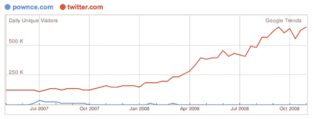

# Pownce Deadpooled，团队移动到六个分开的 

> 原文：<https://web.archive.org/web/https://techcrunch.com/2008/12/01/pownce-deadpooled-team-moves-to-six-apart/>

# Pownce 死了，队伍移动到 6 分开

[Pownce](https://web.archive.org/web/20221220013716/http://www.pownce.com/) ，这个媒体丰富的 Twitter 竞争对手曾经[被《纽约时报》称为](https://web.archive.org/web/20221220013716/http://www.nytimes.com/2007/07/29/business/yourmoney/29stream.html?_r=1)硅谷最热门的创业公司，在被 [Six Apart](https://web.archive.org/web/20221220013716/http://www.sixapart.com/) 收购后走向死亡池。这项服务由 Digg 的[凯文·罗斯](https://web.archive.org/web/20221220013716/http://www.crunchbase.com/person/kevin-rose)以及[莉亚·卡尔弗](https://web.archive.org/web/20221220013716/http://www.crunchbase.com/person/leah-culver)和丹尼尔·布尔卡共同创立，将于 12 月 15 日关闭。用户将能够将他们的账户导出到其他服务，允许他们保留他们的消息和媒体，但看起来 Pownce 用户将不得不转向 Twitter 来满足他们的微博需求(如果他们还没有这样做的话)。卡尔弗和迈克·马龙(Pownce 的两名工程师)将被整合到六个独立的团队中。

这个消息并不令人惊讶——Pownce 长期以来一直在 Twitter 的阴影下挣扎，尽管事实上 pow nce 的工作人员反对被称为 Twitter 的竞争对手。有一些主要的区别:Pownce 允许用户分享照片、音乐、视频、事件，并提供类似官方 AIR 应用程序的细节，但其核心功能仍然非常相似。

我们第一次听说这个网站是在 2007 年夏天，当时它作为 Rose 的秘密新创公司成为头条新闻。兴奋的程度达到了邀请在易贝出售的程度，但到了年底，很明显 Pownce 没有 Twitter 那么快流行起来，看起来它可能会在一月份向公众推出之前就被淘汰。即使是通常喜欢社交网络服务的罗伯特·斯考伯，自七月以来也没有更新过他的账户。

联合创始人 Leah Culver 在 Pownce 的博客上写了一篇半甜蜜的告别文章。