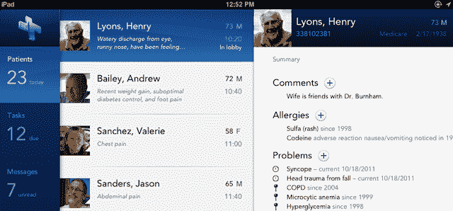

# Practice Fusion 凭借 2500 万份电子病历在电子病历领域排名第一，首次推出 iPad 应用程序| TechCrunch

> 原文：<https://web.archive.org/web/http://techcrunch.com/2011/11/11/practice-fusion-ipad/>

伴随着强大的力量而来的是巨大的责任，这一点在健康技术产业中体现得最为明显。首席执行官 Ryan Howard 今天告诉我，Practice Fusion 是领先的电子医疗记录提供商，现在帮助 13 万名医生跟踪 2500 万名患者的记录。这是 Kaiser Permanente 或 VA 托管的 EMR 的 3 倍以上。Practice Fusion 对医生和患者都是免费的。它通过实验室、药房和制药公司的市场赚钱，这些公司为医生面前的优先位置付费，医生每年通过该平台花费惊人的 400 亿美元。其新的 iPad 应用程序今天在 Practice Fusion 的年度会议上首次亮相，将允许这些医生在办公室外访问记录。

除了拯救生命之外，加州的普通医生每年的支出约为 230 万美元。试想一下，医生有多大的决定权和推荐权:“吃这个药丸不要那个”，“从这个药房拿”，“你的化验结果正在这个实验室分析”。霍华德告诉我，到明年，这个数字将远远超过每年通过易贝花费的 600 亿美元。这些医疗服务提供商在 Practice Fusion 平台上购买昂贵的横幅广告，以确保医生选择它们，这让该公司赚了很多钱。

实践融合的医生和记录摄取率呈指数级增长。当[在 4 月份筹集了 2300 万美元的 B 轮融资](https://web.archive.org/web/20230324213632/https://techcrunch.com/2011/04/05/free-electronic-medical-records-service-practice-fusion-raises-23-million/)时，它统计了 7 万名客户，到 9 月份[再筹集 600 万美元](https://web.archive.org/web/20230324213632/https://techcrunch.com/2011/09/20/free-electronic-medical-records-service-practice-fusion-raises-6m-from-sv-angel-founders-fund-and-others/)时，它已经拥有了 10 万名医疗服务提供者。现在，实践融合有 130，000 人，每个新医生带来大约 2，000 名新患者，他们可以从任何地方访问自己的医疗记录。医生可以在几分钟内开始使用该产品，并可以付费在几天内扫描所有现有的纸质记录。Practice Fusion 的竞争对手可能需要 6 个月或更长时间来设置医生。

Howard 告诉我“我们实际上是医生的销售力量，是健康的脸书。”他解释说，通过其 API，Practice Fusion 将成为来自 FitBit 和无线体重秤等消费设备和服务的个人医疗数据中心。这包括 [100Plus](https://web.archive.org/web/20230324213632/https://techcrunch.com/2011/11/03/100plus-raises-500k-from-founders-fund-and-peter-thiel-to-predict-your-health/) ，霍华德在彼得·泰尔和创始人基金的资助下共同创立的个性化健康预测平台，让人们看到健康的决定如何延长他们的寿命。这个中心可能成为另一个有利可图的医疗广告磁铁。更无私的是，Practice Fusion 正在与 Palantir 和 CDC 合作，利用其数据来检测疾病爆发。

不过，Practice Fusion 的核心目标是让病历访问变得即时而高效。这就是为什么它为移动中的医生推出了一款 iPad 应用程序，该程序由库珀设计，库珀是由 Visual Basic 之父艾兰·库伯领导的公司。它安全地提供了对记录的访问，因此如果医生在下班后接到关于患者的电话，他们手头会有所有必要的医疗数据，以便他们可以做出明智的决定。

优先考虑可用性，医生可以看到他们一天的预约，并立即深入到每个病人的主诉，过敏，问题，药物治疗，家族史，住院等。医生可以记录患者对其症状的口述，并将他们自己的评估和治疗计划与针对常见疾病的预定义治疗计划相结合，以最大限度地减少打字。他们还可以查看任务列表，并从办公室接收更新的推送通知。

实践融合的团队正在改变医疗保健，霍华德说医生们因此而喜欢他们。凭借强劲的增长、客户忠诚度、不断扩大的收入流和雄心勃勃的愿景，Practice Fusion 正朝着让我们所有人更健康、让投资者更富有的方向前进。

