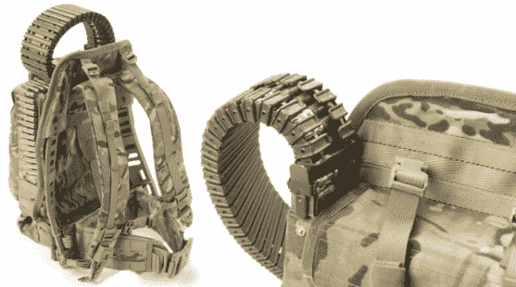

# 阿富汗士兵拼凑的受捕食者启发的弹药背包 TechCrunch

> 原文：<https://web.archive.org/web/http://techcrunch.com/2011/10/17/predator-inspired-ammo-backpack-cobbled-together-by-soldiers-in-afghanistan/>

今年早些时候，一群爱荷华州国民警卫队队员刚刚从阿富汗一场两个半小时的惨烈交火中恢复过来，他们发现自己开始质疑一些新装备的有效性。他们被发给 M240B 轻机枪用于支援火力，但他们发现自己不断地用新的 50 发弹带重新装填弹药，这需要一个弹药携带者准备好一堆弹带。“随身携带的弹药袋使它太笨重，无法进行长途徒步巡逻，尤其是在爬山时。最初，我们想出了使用 50 个圆带，只是不断地重新加载，这导致了火力间歇和低效率，”上士文森特·温科斯基说。

在讨论他们的设置的缺点时(如果你的生命取决于此，你可能会这样做)，有人提到了电影《掠夺者》，在这部电影中，杰西·文图拉的角色背上绑着他的迷你枪的弹药箱。他们对此一笑置之，但温考斯基开始思考，并带着一名军人应有的积极态度，[决定将类似的东西组合在一起。](https://web.archive.org/web/20230203081640/http://www.army.mil/article/67318/_Ironmanan__a_game_changer_on_battlefield/)

他拿了一些他们放在周围的模块化装备(一个携带架，一个多用途的袋子)，把它和一个远程武器站的一些零件组合在一起，经过一点修补和胶水，他自己有了一个工作弹药背包。

他们在靶场上测试了一下，效果不错。当他们的小队在山谷中被一群敌军伏击时，这证明了这不仅仅是一次实验。温考斯基把照片和描述发给了军队研究部门的科学顾问。他们很喜欢。

在 48 天内，他们将一个新的、更轻、更强的原型重新部署到了战区。“我们能够非常快速地将所有东西组装在一起，并且能够证明，在战斗载荷下——500 发子弹重 43 磅，包括套件本身的重量——仍然可以给士兵 17 磅的货物重量，以连接到框架上，并且仍然在 MOLLE medium 的设计规格范围内，”戴夫·罗伊说，他收到了设计并监督了原型制作。

我不仅仅是本着“酷新枪”的精神来发布这个，尽管从这个角度来看，它确实是一个很棒的小工具。我只是觉得创新精神是如何在你最意想不到的时候突然出现的，这真是太棒了，似乎即使在严格监管的军队世界里，一个好主意偶尔也能生根发芽，足以拯救一些人的生命。创造和破解的自由是重要和强大的，为人们提供工具(在这种情况下，前瞻性的模块化系统和实验的意愿)是工业和战争中的优势。

感谢爱荷华州国民警卫队第 34 步兵师第 133 步兵团第 1 营第 2 旅战斗队在海外的辛勤工作。

【via[TechZwn](https://web.archive.org/web/20230203081640/http://techzwn.com/2011/10/predator-inspired-ironman-system-turns-backpack-into-massive-ammo-clip/)；图片来自第 133 届]