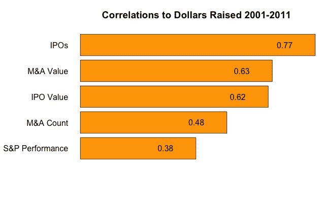
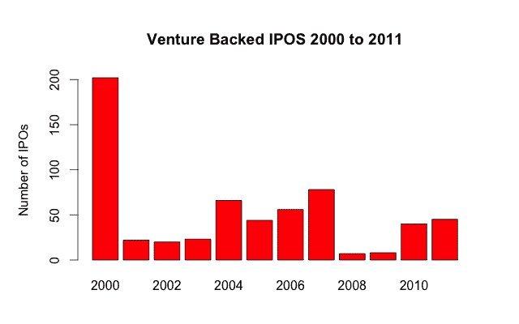
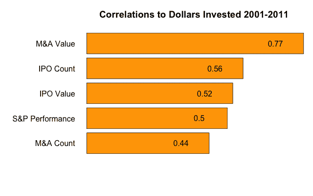

# 筹款市场的预测者 TechCrunch

> 原文：<https://web.archive.org/web/https://techcrunch.com/2012/08/04/predictors-of-the-fundraising-market/>

托马斯·东古兹撰稿人

More posts by this contributor

**编者按:** *这是 Redpoint VC [Tomasz Tunguz 的](https://web.archive.org/web/20221209135250/https://twitter.com/ttunguz)系列文章的第三篇，探讨公共和私人技术市场的趋势。(这里有[一个](https://web.archive.org/web/20221209135250/https://beta.techcrunch.com/2012/07/15/four-trends-in-the-public-technology-market/)和[两个](https://web.archive.org/web/20221209135250/https://beta.techcrunch.com/2012/07/22/venture-capital-now-quality-over-quantity/)。)*

人们普遍认为，股票市场是风险行业的领先健康指标。然而，事实上，标准普尔 500 的表现很少能告诉我们筹资市场的趋势。

在本周的分析中，我利用 NVCA 和雅虎财经 2001 年至 2011 年的年度数据，评估了风险投资融资和风险投资的相关因素。我研究了五个可能的相关变量:IPO 数量、IPO 总价值(IPO 所得)、M&A 交易数量、M&A 总价值和标准普尔 500 的表现(逐年变化)。该分析时间将数据移动一年。

## 首次公开募股的数量是从有限合伙人那里筹集风险资本的最佳预测因素

前一年的首次公开募股数量是风险融资市场的最佳预测指标，相关系数为 0.77。相比之下，S&P 的表现是最差的相关因素，系数为 0.38，这意味着风险融资对 IPO 数量的敏感程度远远高于对公开市场指数的敏感程度。

IPO 总收益与融资额的相关性相当好，但鉴于 2012 年迄今为止脸书 IPO 融资额占 IPO 融资额的 86%以上，这可能会严重扭曲数据集，我怀疑明年 IPO 收益将失去一些预测能力。

过去 10 年，风险投资支持的 IPO 数量的中位数是 40。2011 年，有 45 家风投支持的公司上市，这表明 2012 年应该是风投融资相对平均的一年。展望 2013 年，前景并不明朗。2012 年上半年，30 家风投支持的公司上市，比 2011 年上半年少了 6 家。鉴于其中许多公司表现不佳，2012 年风险投资支持的 IPO 表现可能会低于 10 年中值。

## 总 M&A 价值是风投资金投入的最佳预测指标

风险投资支持的 M&A 的总价值是一年投资金额的最佳领先指标，相关系数也为 0.77。同样，在过去 10 年中，标准普尔 500 的表现是相关性最弱的。
2011 年，风险投资支持的并购达到 464 亿美元，约为 10 年期 240 亿美元中值的两倍，这是 2012 年融资市场健康状况的良好指标。但是 2012 年上半年风险投资支持的并购收入比 2011 年减少了 30%。

## 2012 年和 2013 年展望

尽管相关性不能证明因果关系，但它们可以提供对风险市场未来健康状况的方向性洞察。假设 2012 年低于平均水平的 IPO 和 M&A 趋势保持不变，2013 年对风险融资和投资来说都将是疲软的一年。

*资料来源:*
*风险资金筹集和投资数据由 NVCA 提供*
*公开市场数据由雅虎财经*提供