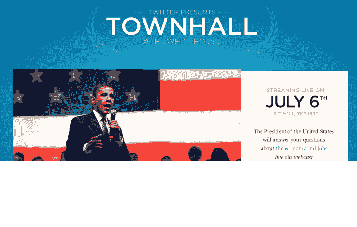

# @杰克到温和派总统@巴拉克奥巴马下周在@Twitter 上的第一个“市政厅”

> 原文：<https://web.archive.org/web/https://techcrunch.com/2011/06/30/president-barackobama-to-hold-first-townhall-on-twitter-next-week/>

# @Jack 到温和派总统@BarackObama 下周在@Twitter 上的第一个“市政厅”

奥巴马总统已经[在脸书和 YouTube 上举办了市政厅](https://web.archive.org/web/20230204114428/https://techcrunch.com/2011/04/20/zuckerberg-obama-answer-questions-at-facebook-hq-today-you-can-watch-the-livestream-here/)，为了使事情更圆满，白宫已经[宣布](https://web.archive.org/web/20230204114428/http://twitter.com/#!/whitehouse/status/86449093542543360)奥巴马总统将于下周在推特上举办他的第一次市政厅。

总统市政厅会议将于美国东部时间 7 月 6 日下午 2 点举行，重点是经济和创造就业机会。人们可以通过在推特上发布标签为#AskObama 的问题来参与，并可以关注 [@Townhall](https://web.archive.org/web/20230204114428/https://twitter.com/#!/townhall) 来获取更新。通过 Twitter 托管的网站，你还可以通过网络直播观看奥巴马总统的回应。Twitter 的联合创始人杰克·多西将主持会议。

考虑到马克·扎克伯格今年早些时候主持了奥巴马的脸书市政厅会议，由@杰克主持会议的事实并不令人惊讶。Twitter 公关负责人肖恩·加勒特在一条推文中说，多尔西将向总统提出这些问题，从这些问题中“选出他们将有一个相当复杂的过程”。

随着 2012 年竞选活动的升温，Twitter 已经成为候选人和公众之间交流的集中平台。几周前，我们[看到](https://web.archive.org/web/20230204114428/https://techcrunch.com/2011/06/17/as-the-2012-campaign-heats-up-president-obama-to-start-tweeting-from-barackobama/)总统的 2012 年竞选团队接管了管理奥巴马的推特([@ Barak Obama](https://web.archive.org/web/20230204114428/http://twitter.com/#!/BarackObama/))和脸书账户(之前由民主党全国委员会管理)。奥巴马本人也将开始在脸书和推特上发布更新。

Twitter 比四年前更具大众吸引力，毫无疑问，这个平台已经成为政治交流和新闻的集中地。Twitter 将成为选举的核心部分(脸书也将如此)，奥巴马正在认真对待这一点，并帮助吸引更多用户使用 Twitter。