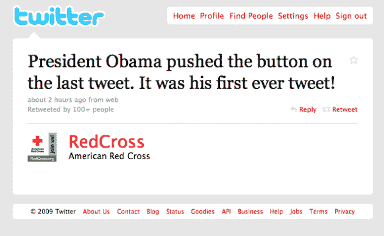

# 奥巴马总统最终以第三人称 TechCrunch 为海地发推文

> 原文：<https://web.archive.org/web/http://techcrunch.com/2010/01/18/president-obama-tweets/>

# 奥巴马总统终于以第三人称为海地发推特了

早在去年 11 月，奥巴马总统[承认](https://web.archive.org/web/20230203100305/https://techcrunch.com/2009/11/15/president-obama-twitter/)他从未真正使用过 Twitter，尽管他有一个最受欢迎的账户。[@巴拉克·奥巴马](https://web.archive.org/web/20230203100305/http://twitter.com/barackobama)账号拥有 200 多万粉丝，在宣布他获得诺贝尔和平奖后，他发了诸如[谦卑](https://web.archive.org/web/20230203100305/http://twitter.com/BarackObama/status/4736968403)之类的微博，但显然这只是他的一名工作人员发的微博。对许多人来说，这并不是一个巨大的惊喜，但至少摧毁了是他发送这些信息的幻觉，这仍然有点令人失望。今天，奥巴马总统终于发微博了。

他的第一条推文不是来自@巴拉克·奥巴马的账户，而是来自[@红十字会](https://web.archive.org/web/20230203100305/http://twitter.com/redcross)的账户。更奇怪的是真正的推特:*奥巴马总统和第一夫人现在正在这里参观我们的灾难处理中心*。是的，他用第三人称发微博。红十字会账户上的下一条[推文](https://web.archive.org/web/20230203100305/http://twitter.com/RedCross/status/7915529685)证实了是总统发了这条推文:“*奥巴马总统按下了最后一条推文的按钮。这是他的第一条微博！*

显然，这条推文是他支持红十字会在上周海地发生毁灭性地震后帮助海地人民的一种方式。不过，对他来说，从他有 200 多万粉丝的账户上发布救灾消息可能比红十字会更好，红十字会只有“区区”5 万粉丝。

仅给红十字会的移动捐款就已经超过了 1000 万美元，移动捐款总额已经超过了 2000 万美元。

