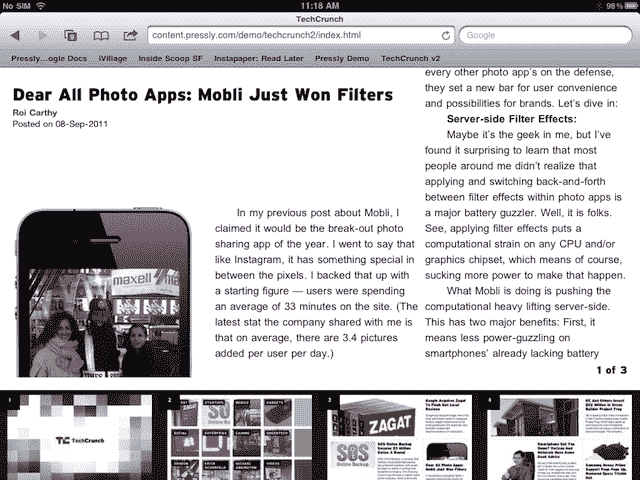
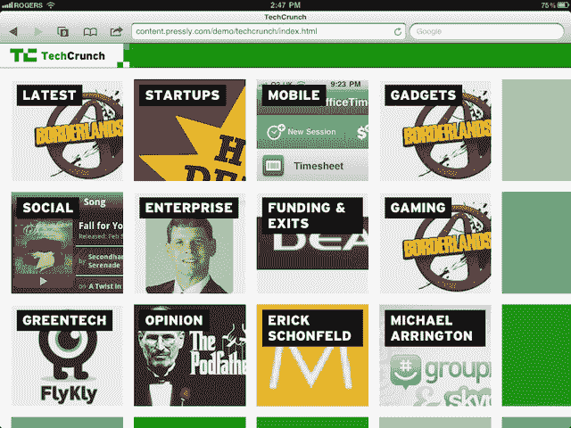
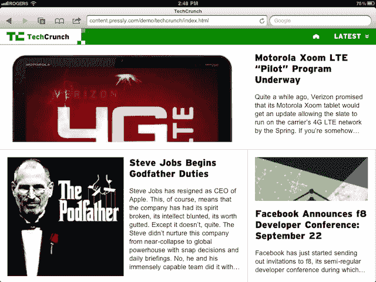

# Pressly 将网站转变为平板电脑友好的 HTML5 网络应用 TechCrunch

> 原文：<https://web.archive.org/web/http://techcrunch.com/2011/09/12/pressly-turns-websites-into-tablet-friendly-html5-web-apps/>

TechCrunch Disrupt 决赛

[Pressly](https://web.archive.org/web/20230203153623/http://www.pressly.com/)

是一个基于 HTML5 的平台，可以将在线出版物转化为平板电脑友好的网站，可以在 iPad、Android 平板电脑或黑莓 PlayBook 上运行。它所制作的网站与本土网站几乎没有区别，比如 Flipboard 和 Zite，为浏览文章、图片和视频提供了类似的体验。导航是为平板电脑界面设计的，使用常见的手势，如多点触控滑动和挤压。

Pressly 的平台包括五个可定制的模板作为起点，每个模板都是根据不同出版商的需求设计的。一个模板更倾向于文本驱动，而另一些更适合浏览照片或视频。像本地应用程序一样，导航一个新闻网站使用直观的手势，比如用两个手指上下滑动以显示快速导航，用手指挤压以关闭文章。

模板引擎也可以引入各种数据提要，比如 JSON、XML、RSS 或 Twitter 和 WordPress 内容。

尽管最终产品与当今流行的平板电脑杂志有相似之处， [Pressly](https://web.archive.org/web/20230203153623/http://www.pressly.com/) 并不是为了替代为 iPad 或其他平板电脑开发本地应用程序而设计的。事实上，该公司甚至不太支持将网址保存为主屏幕图标。相反，Pressly 希望利用平板电脑最受欢迎的应用程序浏览器的人气，立即为网上冲浪者提供平板电脑优化的体验。

此外，由于这些网站只是 HTML 页面，出版商可以集成传统网站中的所有常见功能，包括分析、广告、支付处理、商店搜索等。Pressly 拥有自己的广告平台，出版商和广告商可以在这个平板友好的网站上插入富媒体广告。这些广告可以包括视频、照片、链接、热点、社交分享按钮、详细的跟踪机制，它们甚至可以显示为 360 度沉浸式视图。

Pressly 目前正与加拿大生活杂志、洲际媒体集团和多伦多星报(加拿大最大的日报)以及《经济学人》在纽约的数字团队合作，开发一种新的尚未公布的产品原型。

如果你用的是平板电脑，你可以在这里看到[按下](https://web.archive.org/web/20230203153623/http://www.pressly.com/)的演示。

该公司的创始人包括首席执行官杰夫·布伦纳，首席技术官彼得·基尔蒂卡，营销和媒体主管托宾·达尔林普尔和业务发展主管陈驰。布伦纳和基尔蒂卡之前创办了一家名为[努莱尔](https://web.archive.org/web/20230203153623/http://www.crunchbase.com/company/nulayer)的咨询公司，该公司建立了超过 17 个成功的网络和 iOS 项目，包括广受欢迎的 theScore 体育应用，以及社交照片分享初创公司[crowd rel](https://web.archive.org/web/20230203153623/http://www.crunchbase.com/company/crowdreel)，后者是 2009 年 Twitter Chirp 大会的获胜者。

纽莱尔在该公司有一个少数股东，但 Pressly 本身没有直接资金。该平台的定价尚未确定。

法官问答

专家评委:[艾琳·李](https://web.archive.org/web/20230203153623/http://www.crunchbase.com/person/aileen-lee)(凯鹏华盈、珀金斯、考菲尔德&拜尔斯)[达斯汀·莫斯科维茨](https://web.archive.org/web/20230203153623/http://www.crunchbase.com/person/dustin-moskovitz)(阿萨纳)[迈克尔·帕瑞克](https://web.archive.org/web/20230203153623/http://www.crunchbase.com/person/michael-parekh)(MPi Capital)[约书亚·沙赫特](https://web.archive.org/web/20230203153623/http://www.crunchbase.com/person/joshua-schachter)(捷格)

艾尔:非常漂亮。需要关注某些垂直行业。

答:我们觉得出版商需要这个。这并不是和 Flipboard 直接竞争。

DM:我是 Flipboard 投资者，不确定你的产品是否已经上市。

答:Flipboard 就是 iPad。Pressly 是一种网络技术(HTML5)。此外，出版商可以更好地控制内容。有我们的空间。Flipboard 在 iPad 上进行内容发现，Pressly 使用 Safari 或网络浏览器来提供平板电脑友好的网站。

从用户的角度来看，看起来很棒。关于收入分成的商业模式问题。

答:与出版商分享收入没有前期成本，这对双方都是双赢的局面。如果消费者喜欢并参与其中，出版商可以提高 CPM。可以开始给出版商带来广告清单。

我喜欢这些广告。令人担忧的是，拥有开发商店的人可以建造他们想要的任何东西，留给你的是报纸，那些没有工具来建造它的人。

答:构建平台，出版商可以在此基础上进行构建。出版商擅长讲故事，不擅长这样的创新。

**后台面试:**