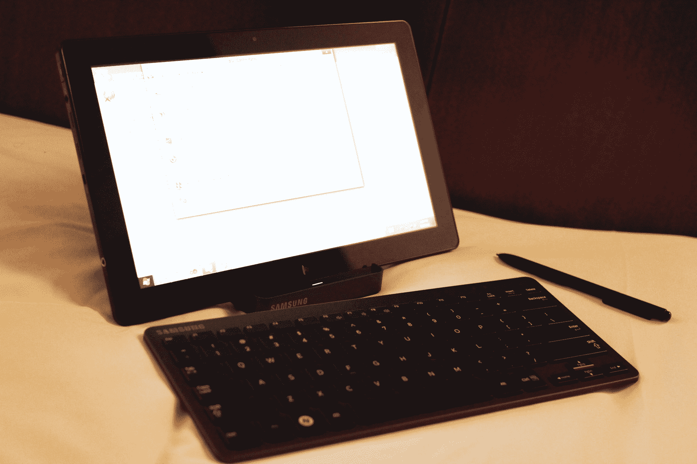
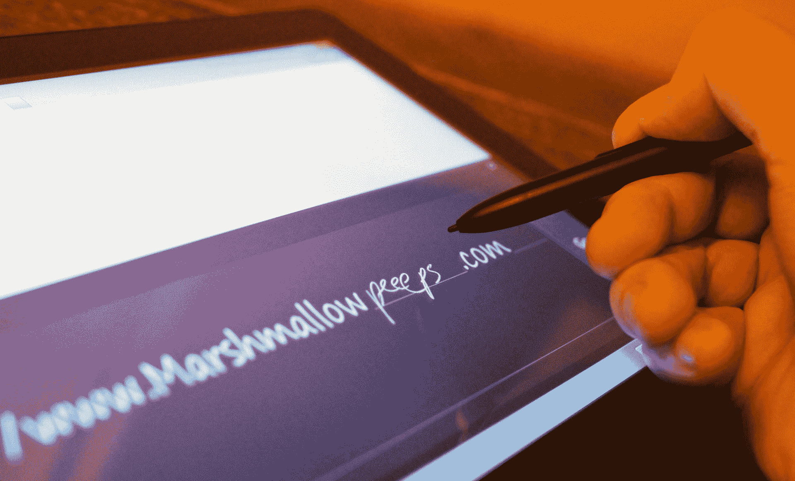
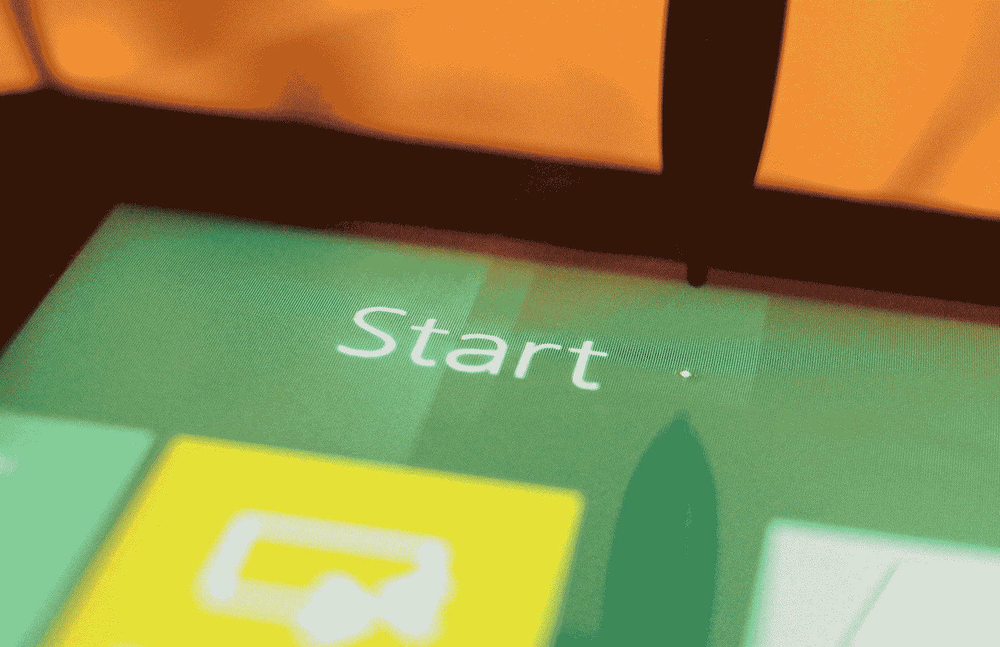

# 预览未来:动手操作 Windows 8 

> 原文：<https://web.archive.org/web/http://techcrunch.com/2011/09/13/previewing-the-future-hands-on-with-windows-8/>

在过去的两天里，我一直在使用一台原型 Windows 8 平板电脑——实际上是一台 PC——并发现 Windows XP 和一些奇怪的触摸用户界面的令人失望的大杂烩，Windows Metro/desktop 系统实际上非常酷，非常直观。在某种程度上，下一代 Windows 8 与之前的 Windows 版本完全不同，在其他方面，它是对我们所知的 Windows 桌面的迭代改进。

没有后 PC 时代。运行 Windows 8 的一切都是 PC。没错——这款平板电脑就是一台 PC。一方面，这种命名方式让微软完全避免了“比 iPad 更好”的争论，另一方面，这也是该公司振兴摇摇欲坠的桌面市场的一种别出心裁的方式。

**云正正经经。**微软在他们的云系统上投入了相当多的时间和精力。例如，在 Microsoft Messenger 中进行的聊天将在不同的计算机之间保持不变。您登录屏幕上的个人资料图片将出现在您登录的每台机器上。安全性是精细的——您的数据在机器上是安全的，也可以出现在云中。这是您或您的 It 部门的选择。

**任何人都可以成为程序员。**你可以用 HTML5 和 Javscript 构建一个可以在 Windows 8 和 Windows Phone 上运行的应用。像 iOS 一样，Windows 是新一代设备的 DNA，它使用我们习惯的核心代码，并像往常一样扩展或收缩它。

Windows 不再庞大了。因为有了云，Windows 实际上可以从 u 盘启动。显然，从 u 盘启动有一些非常具体的原因，但这很酷，因为它可以。Windows 现在根据其运行的硬件公开不同的 API，这使得它可以在 ARM 机器以及市场上最快的 x86 处理器上工作。

**还有其他的工作方式。Windows 8 支持笔、手写、触摸以及语音、舞蹈和歌曲作为输入。例如，您可以添加一个鼠标和键盘，拥有一台出色的 PC，或者您可以随身携带该设备，随时随地使用 Windows。显然，我们测试的设备有一个巨大的、尺寸怪异的屏幕，但除此之外，它是一台非常好用的机器。**

不管喜欢与否，微软拥有个人电脑业务的很大一部分。Windows 8 完美吗(至少在这个早期的化身中？)绝对不是。但是这个版本非常…有趣。我喜欢地铁。这是对 Windows Phone 界面的令人着迷的重新思考，与 Lion 的 LaunchPad 和 Mission Control 视图非常相似。看到设备转储回标准的 Windows 模式很不和谐——所有的窗口、图标和按钮在 Metro 旁边看起来都很悲伤和孤独。

这是 Windows 8。我们对此无能为力。它的目标是消费者，它从一开始就支持触摸，这是一个令人兴奋的与旧的告别。微软在此次发布中做出的妥协——对旧窗口方法的依赖是最明显的——但很明显，云访问、新的触摸界面(包括手写和基于手指的 UI 处理)以及所有的改进(包括旧注册表的缓慢销毁)都是正确的方向。

很多人会对这个操作系统感到非常舒服和兴奋。许多 IT 人员面临着被推回、恼怒，并吵着要回到原来的做事方式。最终，微软会赢。操纵一个庞然大物很难，但是当它移动的时候不要挡住它的路。

* * *

这里是德文·寇地威。我花了一点时间使用三星的原型硬件，不足以习惯它，但足以获得一些第一印象。这感觉有点笨重，但这是当你做一个基本上是个人电脑的东西时的妥协的一部分。我会非常舒服地把它放入 dock，然后用它完成一天的工作。

在 Windows 8 和……Windows 8“原始风味”之间切换感觉有点奇怪，尽管它非常爽快，并且可能会成为第二天性。我真的希望微软的开发人员能够让这两种模式都值得使用，否则人们最终会将 80%的时间花在他们喜欢的部分，并对他们不得不花在另一部分的 20%的时间感到不满。

自 Windows 95 以来，视觉和 UX 部门的质量控制在 Windows 8 中将比微软历史上任何时候都更加关键。这是一个重大的变化，如果他们半途而废或标准松懈，他们将从一开始就失去控制。

键盘和 dock 很匿名，但工作正常。我不得不进入老派的控制面板来找到蓝牙面板，但这只是一个实现的东西，还没有完全实现。控制面板*面板*手感很好:你关心的设置，呈现得干净漂亮。与 iPad 的控制面板相比，这个感觉更强大，也更容易使用。

硬件做工精细。作为一个平板电脑，它感觉太大了，长宽比有点低。这个尺寸的 16:9 感觉有点不平衡。不过，作为一个小显示器，它感觉还不错。

手写识别很棒，触摸屏对笔和触摸都有反应。如果两者都将成为主要的输入模式，那么在书写和常规键盘之间的切换应该更加直观。

我会试着从这件事开始工作一段时间，看看我对它的感觉如何。这是早期的硬件和早期的软件，所以我不想太苛刻，也不想承诺推荐一些以后可能会有显著变化的东西。

看看下面的图片，看看我第一眼看到的一些有趣的 UI 元素和特性。我们稍后将通过更深入的印象和一些视频进行跟进。